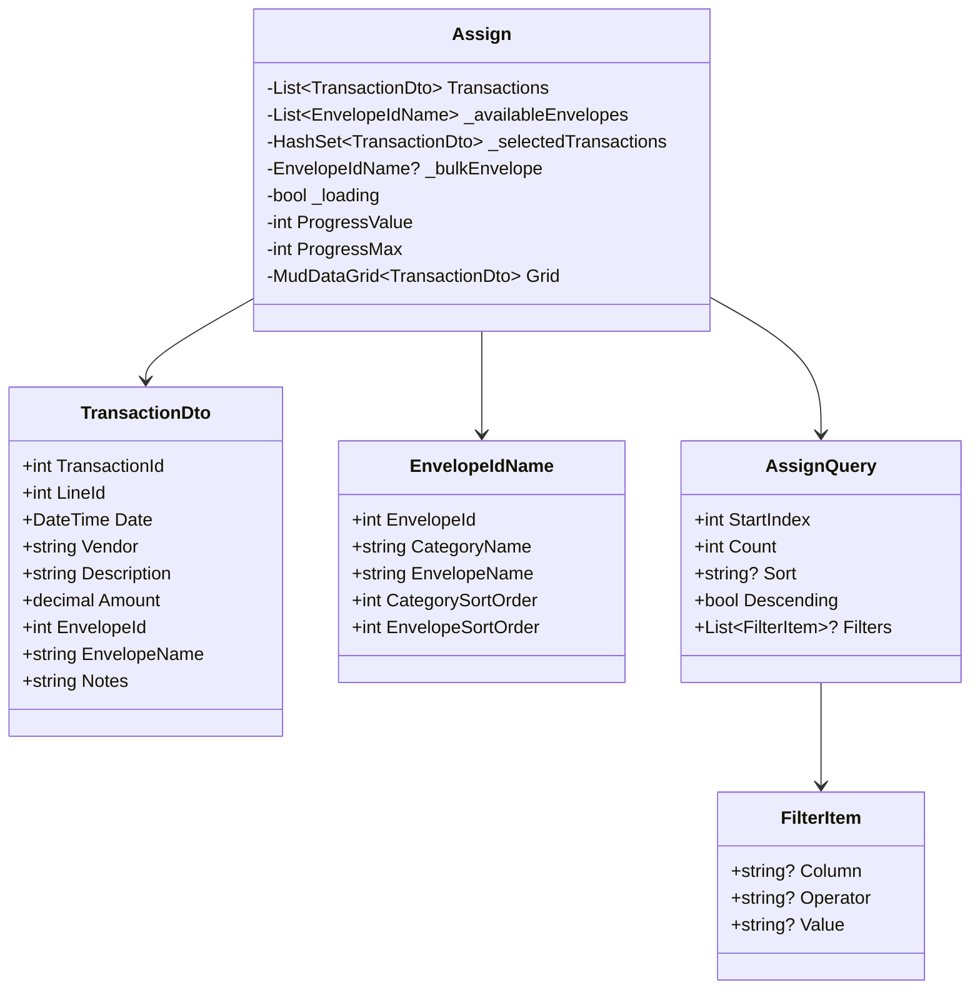
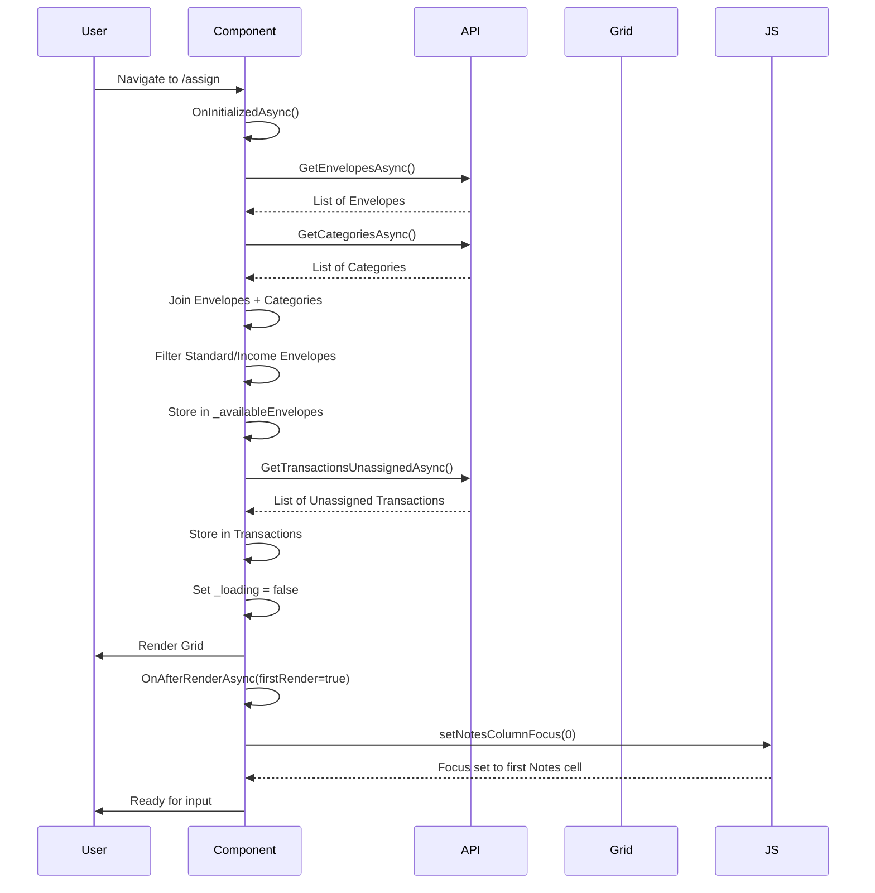
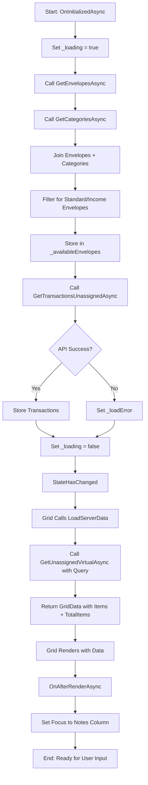
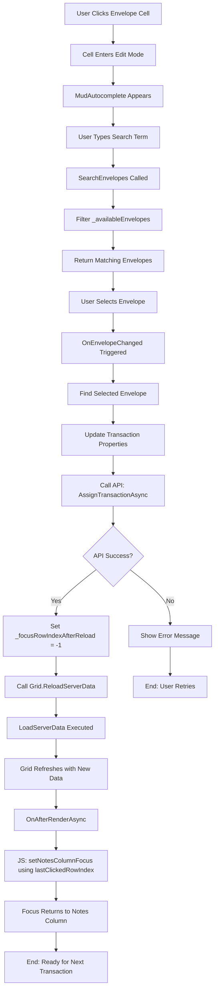
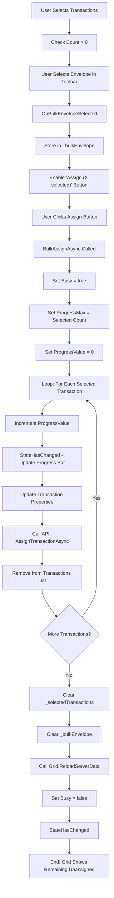
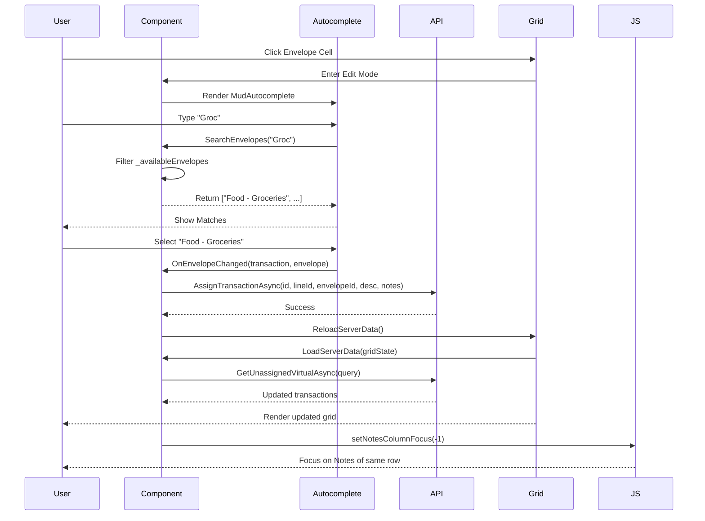
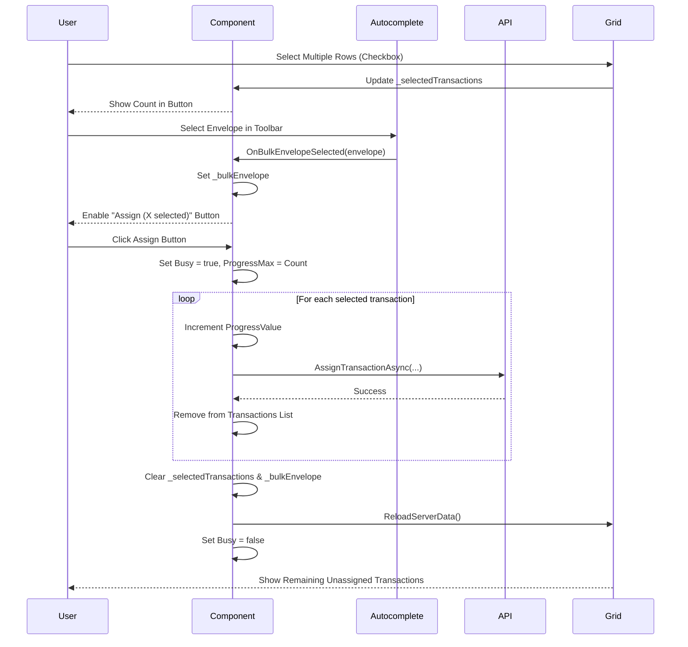
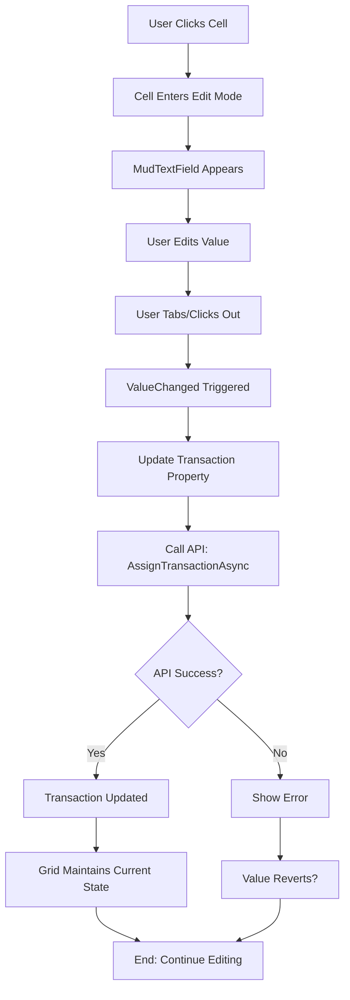
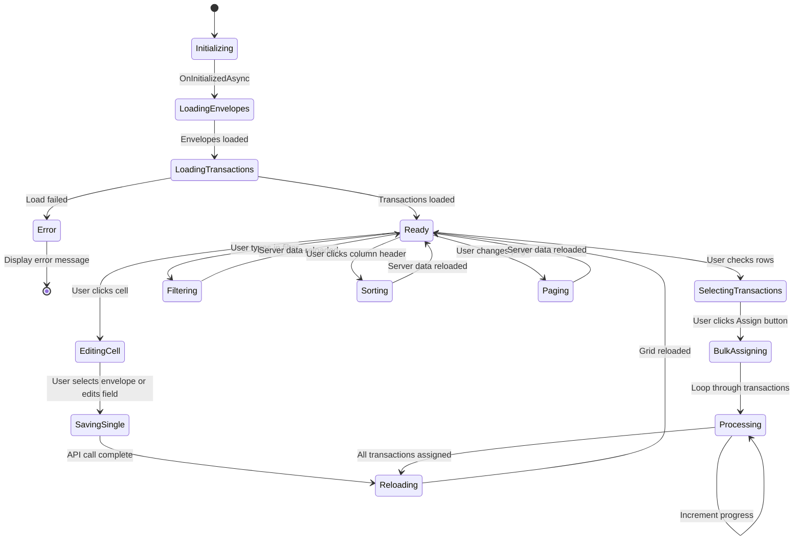
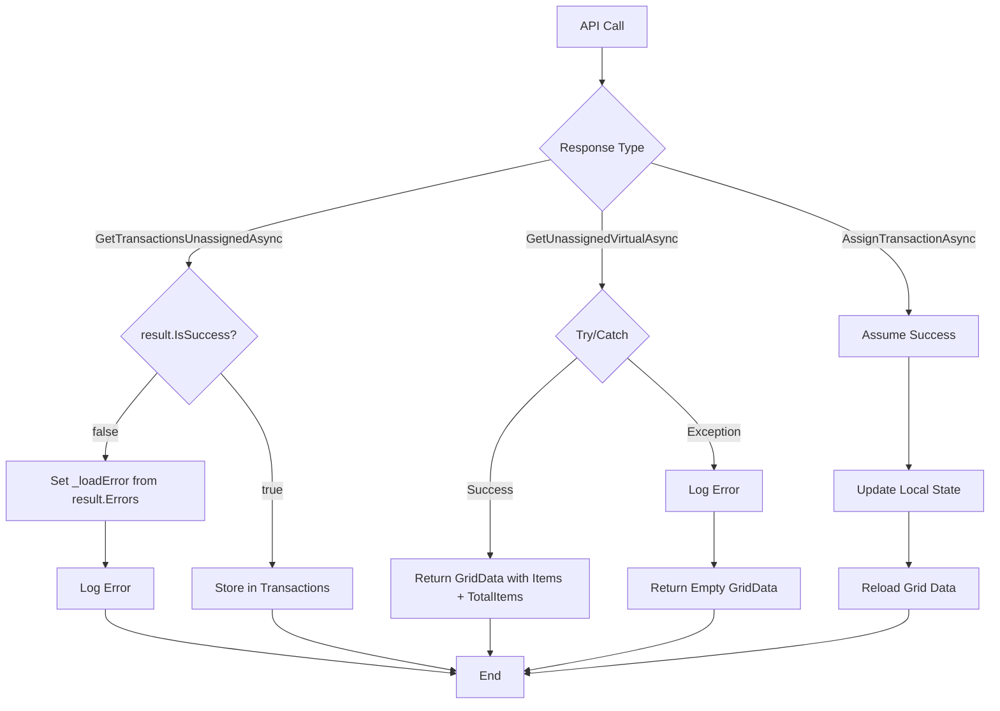

# Assign Page Documentation

> **📘 Related Documentation**: For a technical overview of the complete CSV import and transaction assignment process (APIs, entities, and DTOs), see [Transaction Import & Assignment Technical Flow](../../Documentation/Transaction-Import-Assignment-Technical-Flow.md)

## Table of Contents

- [Overview](#overview)
  - [Key Features](#key-features)
- [Architecture](#architecture)
  - [Component Structure](#component-structure)
  - [Data Model Hierarchy](#data-model-hierarchy)
- [Component Lifecycle](#component-lifecycle)
- [Data Flow](#data-flow)
  - [Loading Data Flow](#loading-data-flow)
  - [Single Assignment Flow](#single-assignment-flow)
  - [Bulk Assignment Flow](#bulk-assignment-flow)
- [Key Operations](#key-operations)
  - [1. Single Transaction Assignment](#1-single-transaction-assignment)
  - [2. Bulk Assignment](#2-bulk-assignment)
  - [3. Editing Transaction Details](#3-editing-transaction-details)
- [UI Layout](#ui-layout)
  - [Desktop Layout](#desktop-layout)
  - [Grid Features](#grid-features)
- [State Management](#state-management)
  - [Primary State Variables](#primary-state-variables)
  - [State Transitions](#state-transitions)
- [API Integration](#api-integration)
  - [API Endpoints Used](#api-endpoints-used)
  - [API Response Handling](#api-response-handling)
- [User Interactions](#user-interactions)
  - [Envelope Assignment](#envelope-assignment)
  - [Editing Fields](#editing-fields)
  - [Multi-Selection](#multi-selection)
  - [Keyboard Support](#keyboard-support)
- [Server-Side Data Loading](#server-side-data-loading)
  - [GridState Processing](#gridstate-processing)
  - [Filtering](#filtering)
  - [Sorting](#sorting)
  - [Pagination](#pagination)
- [JavaScript Interop](#javascript-interop)
  - [Functions Used](#functions-used)
  - [Focus Management](#focus-management)
- [Styling](#styling)
  - [Key CSS Classes](#key-css-classes)
  - [Layout Strategy](#layout-strategy)
- [Performance Considerations](#performance-considerations)
  - [Optimization Techniques](#optimization-techniques)
  - [Potential Bottlenecks](#potential-bottlenecks)
- [Error Handling](#error-handling)
  - [API Error Handling](#api-error-handling)
  - [Defensive Checks](#defensive-checks)
- [Testing Considerations](#testing-considerations)
  - [Unit Test Scenarios](#unit-test-scenarios)
  - [Integration Test Scenarios](#integration-test-scenarios)
- [Future Enhancement Ideas](#future-enhancement-ideas)
- [Dependencies](#dependencies)
  - [NuGet Packages](#nuget-packages)
  - [Injected Services](#injected-services)
  - [Custom Types](#custom-types)
- [Code Metrics](#code-metrics)
- [Maintenance Notes](#maintenance-notes)
  - [Common Modifications](#common-modifications)
  - [Breaking Change Risks](#breaking-change-risks)
- [Troubleshooting Guide](#troubleshooting-guide)
- [Accessibility](#accessibility)
  - [Keyboard Support](#keyboard-support-1)
  - [Screen Reader Support](#screen-reader-support)
  - [Visual Indicators](#visual-indicators)
- [Security Considerations](#security-considerations)
- [Related Components](#related-components)
- [Revision History](#revision-history)
- [Quick Reference](#quick-reference)
  - [Most Common User Tasks](#most-common-user-tasks)
  - [Most Common Developer Tasks](#most-common-developer-tasks)
- [Conclusion](#conclusion)

---

## Overview

The Assign page (`Assign.razor` and `Assign.razor.cs`) is a Blazor component that provides a powerful interface for assigning unassigned transactions to budget envelopes. It displays transactions in a sophisticated data grid with inline editing, filtering, sorting, and both single and bulk assignment capabilities.

### Key Features

- **Server-Side Data Loading**: Efficient pagination, filtering, and sorting on the server
- **Inline Cell Editing**: Edit Notes, Vendor, Description, and Envelope assignment directly in the grid
- **Smart Autocomplete**: Intelligent envelope search with category and envelope name matching
- **Bulk Assignment**: Select multiple transactions and assign them to an envelope in one operation
- **Real-time Progress**: Visual progress indicator during bulk operations
- **Multi-Column Filtering**: Filter transactions by Vendor and Description
- **Multi-Column Sorting**: Sort by Date, Amount, Vendor, Description, or Envelope
- **Virtualization**: Efficient rendering of large datasets
- **Automatic Focus Management**: Smart focus handling after assignment to streamline workflow
- **Responsive Design**: Adapts to different screen sizes

---

## Architecture

### Component Structure

```
Assign.razor (View)
├── Loading indicator (progress circle)
├── Error display (if load fails)
├── Progress bar (for bulk operations)
└── MudDataGrid
    ├── Toolbar
    │   ├── Bulk envelope autocomplete
    │   ├── Assign button (with count)
    │   └── Spacer
    ├── Columns
    │   ├── Select column (multi-select)
    │   ├── Date (read-only, sortable)
    │   ├── Notes (editable)
    │   ├── Envelope (editable via autocomplete)
    │   ├── Vendor (editable, filterable)
    │   ├── Description (editable, filterable)
    │   └── Amount (read-only, sortable)
    └── Pager (50, 100, 200 items per page)

Assign.razor.cs (Code-behind)
├── State management
├── Server-side data loading
├── Envelope search functionality
├── Single assignment handler
├── Bulk assignment handler
├── Field editing handlers
├── API communication
└── Focus management
```

### Data Model Hierarchy



---

## Component Lifecycle



---

## Data Flow

### Loading Data Flow



### Single Assignment Flow



### Bulk Assignment Flow



---

## Key Operations

### 1. Single Transaction Assignment

Assigns a single transaction to an envelope via inline editing.



**Impact**: 
- Transaction is assigned to the selected envelope
- Transaction is removed from the unassigned list
- Focus automatically returns to Notes column for easy data entry

### 2. Bulk Assignment

Assigns multiple selected transactions to a single envelope.



**Impact**:
- All selected transactions are assigned to the same envelope
- Progress bar shows real-time progress
- Selections are cleared after assignment
- Grid refreshes to show remaining unassigned transactions

### 3. Editing Transaction Details

Users can edit Notes, Vendor, and Description fields inline.



**Note**: Unlike envelope assignment, editing Notes, Vendor, or Description does **not** trigger a grid reload, allowing for faster inline editing.

---

## UI Layout

### Desktop Layout

```
┌────────────────────────────────────────────────────────────────────────────┐
│ Unassigned Transactions                                                    │
├────────────────────────────────────────────────────────────────────────────┤
│ [Progress Bar - Shows during bulk operations]                             │
├────────────────────────────────────────────────────────────────────────────┤
│ TOOLBAR                                                                    │
├────────────────────────────────────────────────────────────────────────────┤
│ [🔍 Select Envelope for Bulk Assignment...]  [Assign (3 selected)] [Spacer]│
├────────────────────────────────────────────────────────────────────────────┤
│ DATA GRID                                                                  │
├───┬────────┬─────────┬─────────────┬──────────┬──────────────┬────────────┤
│ ☐ │ Date   │ Notes   │ Envelope    │ Vendor   │ Description  │ Amount     │
├───┼────────┼─────────┼─────────────┼──────────┼──────────────┼────────────┤
│ ☐ │ 1/15/24│ Walmart │ [Search...] │ Walmart  │ Groceries    │ $123.45    │
├───┼────────┼─────────┼─────────────┼──────────┼──────────────┼────────────┤
│ ☐ │ 1/16/24│         │ [Search...] │ Shell    │ Gas          │  $45.00    │
├───┼────────┼─────────┼─────────────┼──────────┼──────────────┼────────────┤
│ ☑ │ 1/17/24│ Online  │ [Search...] │ Amazon   │ Books        │  $28.99    │
├───┼────────┼─────────┼─────────────┼──────────┼──────────────┼────────────┤
│ ☑ │ 1/18/24│         │ [Search...] │ Target   │ Household    │  $67.50    │
├───┼────────┼─────────┼─────────────┼──────────┼──────────────┼────────────┤
│ ☑ │ 1/19/24│ Gift    │ [Search...] │ Best Buy │ Electronics  │ $199.00    │
├───┼────────┼─────────┼─────────────┼──────────┼──────────────┼────────────┤
│ ...more transactions...                                            ▲      │
│                                                                     ▼      │
├────────────────────────────────────────────────────────────────────────────┤
│ PAGER                                                                      │
├────────────────────────────────────────────────────────────────────────────┤
│ Rows per page: [50 ▼]    1-50 of 237    [◄ Previous] [Next ►]           │
└────────────────────────────────────────────────────────────────────────────┘
```

### Grid Features

**Column Details**:

| Column | Type | Editable | Sortable | Filterable | Notes |
|--------|------|----------|----------|------------|-------|
| Select | Checkbox | N/A | No | No | Multi-selection for bulk operations |
| Date | Date | No | Yes | No | Formatted as short date (MM/dd/yyyy) |
| Notes | Text | Yes | No | No | Free-form text for transaction notes |
| Envelope | Autocomplete | Yes | Yes | No | Searchable dropdown with category + envelope |
| Vendor | Text | Yes | Yes | Yes | Column filter available |
| Description | Text | Yes | Yes | Yes | Column filter available, resizable |
| Amount | Currency | No | Yes | No | Read-only, right-aligned |

**Grid Configuration**:
- **Edit Mode**: Cell-level editing
- **Filter Mode**: Column filter row (shown for Vendor and Description)
- **Sort Mode**: Multiple column sorting
- **Selection Mode**: Multi-selection enabled
- **Dense Mode**: Compact row spacing
- **Fixed Header**: Header remains visible during scroll
- **Virtualization**: Efficient rendering of large datasets
- **Height**: `calc(100vh - 250px)` (dynamic viewport height)
- **Column Resizing**: Container-based resizing

---

## State Management

### Primary State Variables

| Variable | Type | Purpose |
|----------|------|---------|
| `_loading` | `bool` | Shows/hides initial loading indicator |
| `Busy` | `bool` | Indicates when bulk operation is in progress |
| `_loadError` | `string?` | Stores error message if loading fails |
| `Transactions` | `List<TransactionDto>` | Initial list of unassigned transactions |
| `Grid` | `MudDataGrid<TransactionDto>` | Reference to the data grid component |
| `_availableEnvelopes` | `List<EnvelopeIdName>` | Filtered list of assignable envelopes |
| `_selectedTransactions` | `HashSet<TransactionDto>` | Currently selected transactions for bulk assignment |
| `_bulkEnvelope` | `EnvelopeIdName?` | Envelope selected for bulk assignment |
| `ProgressValue` | `int` | Current progress in bulk operation |
| `ProgressMax` | `int` | Total transactions in bulk operation |
| `_afterRenderInit` | `bool` | Tracks initial render completion |
| `_focusRowIndexAfterReload` | `int` | Tracks which row should receive focus after reload |
| `_setInitialFocus` | `bool` | Ensures initial focus is set only once |

### State Transitions



---

## API Integration

### API Endpoints Used

| Endpoint | Method | Purpose |
|----------|--------|---------|
| `GetEnvelopesAsync()` | GET | Load all envelopes for autocomplete |
| `GetCategoriesAsync()` | GET | Load all categories for envelope display |
| `GetTransactionsUnassignedAsync()` | GET | Load initial unassigned transactions count |
| `GetUnassignedVirtualAsync(query)` | POST | Server-side filtering, sorting, paging of unassigned transactions |
| `AssignTransactionAsync(transactionId, lineId, envelopeId, description, notes)` | PUT | Assign a transaction to an envelope |

### API Response Handling



**Note**: The current implementation of `AssignTransactionAsync` does not explicitly check for API errors. Future enhancement could add error handling here.

---

## User Interactions

### Envelope Assignment

**Trigger**: User clicks on an Envelope cell

**Flow**:
1. Grid enters cell edit mode
2. MudAutocomplete component appears
3. Component calls `SearchEnvelopes()` with empty string (shows all)
4. User types search term
5. `SearchEnvelopes()` filters `_availableEnvelopes` by CategoryName or EnvelopeName
6. User selects envelope from dropdown
7. `OnEnvelopeChanged()` is triggered
8. Component calls `OnEnvelopeSelectedAsync()`
9. API call: `AssignTransactionAsync()`
10. Grid reloads via `Grid.ReloadServerData()`
11. JavaScript sets focus to Notes column of same row

**Autocomplete Behavior**:
- **Open on Focus**: Dropdown opens when cell enters edit mode
- **Search Function**: Filters envelopes by category or envelope name (case-insensitive)
- **Display Format (in cell)**: Envelope name only
- **Display Format (in toolbar)**: "Category - Envelope"
- **Progress Indicator**: Shows while loading search results
- **Max Items**: null (no limit)

### Editing Fields

**Editable Fields**:
- **Notes**: Free-form text field (stored in `TransactionDetail.Notes`)
- **Vendor**: Free-form text field (stored in `Transaction.Vendor`)
- **Description**: Free-form text field (stored in `Transaction.Description`)

**Behavior**:
- Click cell to enter edit mode
- MudTextField appears
- Type new value
- Tab, click out, or press Enter to save
- `Immediate="false"`: Waits for blur/Enter before saving
- **ValueChanged handlers trigger API calls**:
  - `OnNotesChanged()` → Updates `TransactionDetail.Notes`
  - `OnVendorChanged()` → Updates `Transaction.Vendor`
  - `OnDescriptionChanged()` → Updates `Transaction.Description`
- API call: `AssignTransactionAsync(transactionId, lineId, envelopeId, vendor, description, notes)`
- Grid does **not** reload (local update only for performance)
- Changes are persisted immediately to database

### Multi-Selection

**Selecting Transactions**:
1. Click checkbox in Select column to select individual rows
2. Or click header checkbox to select all visible rows
3. Selected count appears in button: "Assign (X selected)"
4. Bulk envelope autocomplete is enabled

**Deselecting**:
- Click checkbox again to deselect
- Or complete bulk assignment (auto-clears selection)

### Keyboard Support

**Grid Navigation**:
- **Tab**: Move to next cell
- **Shift+Tab**: Move to previous cell
- **Enter**: Edit current cell (if editable)
- **Escape**: Cancel edit
- **Arrow Keys**: Navigate cells when not editing

**Autocomplete**:
- **Arrow Down/Up**: Navigate suggestions
- **Enter**: Select highlighted suggestion
- **Escape**: Close dropdown without selecting

**After Assignment**:
- JavaScript automatically sets focus to Notes column
- User can immediately start typing notes
- Tab to next field or next row

---

## Server-Side Data Loading

The Assign page uses **server-side data loading** via MudDataGrid's `ServerData` parameter. This means the grid does not hold all transactions in memory; instead, it requests data on-demand as users filter, sort, or page.

### GridState Processing

```csharp
private async Task<GridData<TransactionDto>> LoadServerData(GridState<TransactionDto> gridState, CancellationToken cancellationToken)
{
    var query = new AssignQuery
    {
        StartIndex = gridState.Page * gridState.PageSize,
        Count = gridState.PageSize,
        Sort = gridState.SortDefinitions.FirstOrDefault()?.SortBy,
        Descending = gridState.SortDefinitions.FirstOrDefault()?.Descending ?? false,
        Filters = [.. gridState.FilterDefinitions.Select(f => new FilterItem
        {
            Column = f.Column?.PropertyName,
            Operator = f.Operator,
            Value = f.Value?.ToString()
        })]
    };

    var response = await Api.GetUnassignedVirtualAsync(query, cancellationToken);

    return new GridData<TransactionDto>
    {
        Items = response.Items,
        TotalItems = response.TotalCount
    };
}
```

**Flow**:
1. User interacts with grid (filter, sort, page change)
2. MudDataGrid detects state change
3. Grid calls `LoadServerData()` with updated `GridState`
4. Component converts `GridState` to `AssignQuery`
5. API call: `GetUnassignedVirtualAsync(query)`
6. Server filters, sorts, paginates data
7. Returns subset of transactions + total count
8. Grid renders new data

### Filtering

**Available Filters**:
- **Vendor**: Case-insensitive substring match
- **Description**: Case-insensitive substring match

**Filter UI**:
- Column filter row appears below column headers
- Type in filter box to apply filter
- Filter is applied on server-side (not client-side)

**Filter Operators** (from MudBlazor):
- Contains
- StartsWith
- EndsWith
- Equals
- NotEquals
- etc.

### Sorting

**Sortable Columns**:
- Date
- Envelope (by EnvelopeName)
- Vendor
- Description
- Amount

**Sort Behavior**:
- Click column header to sort ascending
- Click again to sort descending
- Click again to remove sort
- **Multi-sort**: Hold Shift and click multiple headers

### Pagination

**Page Sizes**:
- 50 (default)
- 100
- 200

**Pager Controls**:
- Previous / Next buttons
- Current page indicator
- Total item count

**Server-Side Calculation**:
```csharp
StartIndex = gridState.Page * gridState.PageSize
Count = gridState.PageSize
```

Example: Page 2, PageSize 50 → StartIndex = 100, Count = 50

---

## JavaScript Interop

### Functions Used

**setNotesColumnFocus(rowIndex)**
- **Purpose**: Sets focus to the Notes column of a specific row
- **Parameters**:
  - `rowIndex` (int): Index of row to focus (-1 = use last clicked row)
- **Return**: void
- **Behavior**:
  - If `rowIndex === -1`, uses `window.lastClickedRowIndex`
  - Finds Notes cell via `data-label="Notes"` attribute
  - If cell not in edit mode, clicks to enter edit mode
  - Waits 100ms for input to render
  - Sets focus to input element
  - Retries up to 20 times if rows not loaded yet

### Focus Management

**Tracking Last Clicked Row**:
```javascript
window.lastClickedRowIndex = -1;

document.addEventListener('click', function(e) {
  const cell = e.target.closest('td');
  if (cell) {
    const row = cell.closest('tr.mud-table-row');
    if (row) {
      const tbody = row.closest('.mud-table-body');
      if (tbody) {
        const allRows = tbody.querySelectorAll('.mud-table-row');
        const rowIndex = Array.from(allRows).indexOf(row);
        if (rowIndex >= 0) {
          window.lastClickedRowIndex = rowIndex;
        }
      }
    }
  }
});
```

**Why This Matters**:
- After assigning an envelope, the grid reloads
- The row index may change due to filtering/sorting
- By tracking the last clicked row, focus returns to the correct row
- This creates a seamless data entry experience

**Usage in Component**:
```csharp
_focusRowIndexAfterReload = -1;  // Signal to use lastClickedRowIndex
await Grid.ReloadServerData();    // Reload grid

// In OnAfterRenderAsync:
if (_focusRowIndexAfterReload >= -1)
{
    var rowIndex = _focusRowIndexAfterReload;
    _focusRowIndexAfterReload = -2;  // Reset flag
    await SetFocusToNotesColumnAsync(rowIndex);
}
```

---

## Styling

### Key CSS Classes

| Class | Purpose |
|-------|---------|
| `.envelopes-table` | Applied to MudDataGrid for custom styling and JavaScript targeting |
| `.mud-table-row` | MudBlazor table row (used for focus management) |
| `.mud-table-body` | MudBlazor table body (container for rows) |
| `[data-label="Notes"]` | Attribute selector for Notes column (used in JavaScript) |

### Layout Strategy

**Grid Sizing**:
- **Height**: `calc(100vh - 250px)` - Dynamic height based on viewport
- **Overflow**: `auto` - Scrollable content
- **Width**: `auto` - Fits content
- **Wrapper**: `min-height: 0; overflow: hidden` - Prevents flex overflow issues

**Column Widths**:
- **Select**: Auto (checkbox width)
- **Date**: `min-width: 50px`
- **Notes**: Auto
- **Envelope**: Auto
- **Vendor**: Auto
- **Description**: Auto (resizable)
- **Amount**: Auto (right-aligned)

**Responsive Behavior**:
- Grid is horizontally scrollable on small screens
- Column filter inputs adjust to column width
- Toolbar items stack on very small screens (MudBlazor default behavior)

---

## Performance Considerations

### Optimization Techniques

1. **Server-Side Data Loading**
   - Only loads visible page of transactions
   - Filtering and sorting done on server
   - Reduces client-side memory usage
   - Enables handling of 1000+ transactions efficiently

2. **Virtualization**
   - `Virtualize="true"` on MudDataGrid
   - Only renders visible rows in viewport
   - Improves rendering performance with large datasets

3. **Envelope Caching**
   - Loads envelopes once during initialization
   - Stores in `_availableEnvelopes` for search
   - Avoids repeated API calls

4. **Selective Grid Reloads**
   - Envelope assignment: Reloads grid (removes assigned transaction)
   - Notes/Vendor/Description edit: Does **not** reload grid (faster)
   - Bulk assignment: Single reload after all assignments complete

5. **Progress Indication**
   - Shows real-time progress during bulk operations
   - Prevents UI from appearing frozen
   - User feedback improves perceived performance

6. **Async Operations**
   - All API calls are async
   - Prevents UI blocking
   - Cancellation token support in `LoadServerData()`

### Potential Bottlenecks

1. **Large Bulk Assignments**
   - Each transaction calls API sequentially
   - 100 transactions = 100 API calls
   - **Mitigation**: Progress bar provides feedback
   - **Future Enhancement**: Batch API endpoint for bulk assignment

2. **Autocomplete Search**
   - Searches entire `_availableEnvelopes` list in memory
   - With 100+ envelopes, could lag slightly
   - **Mitigation**: Case-insensitive `Contains()` is fast
   - **Future Enhancement**: Server-side envelope search

3. **Grid Reload Frequency**
   - Every envelope assignment triggers a reload
   - With slow server responses, could feel sluggish
   - **Mitigation**: Focus management makes flow feel seamless
   - **Future Enhancement**: Optimistic UI updates (remove row immediately)

4. **Initial Load Time**
   - Loads envelopes, categories, and initial transaction count
   - Multiple API calls in sequence
   - **Mitigation**: Parallel API calls possible
   - **Future Enhancement**: Single combined endpoint

---

## Error Handling

### API Error Handling

**Initial Load Errors**:
```csharp
try
{
    var result = await Api.GetTransactionsUnassignedAsync();
    if (result.IsSuccess)
    {
        Transactions = result.Value;
    }
    else
    {
        _loadError = string.Join(", ", result.Errors.Select(e => e.Message));
        Logger.LogError("Failed to load unassigned transactions: {Errors}", _loadError);
    }
}
catch (Exception ex)
{
    _loadError = ex.Message;
    Logger.LogError(ex, "Error in OnInitializedAsync");
}
finally
{
    _loading = false;
}
```

**Server Data Load Errors**:
```csharp
try
{
    var response = await Api.GetUnassignedVirtualAsync(query, cancellationToken);
    return new GridData<TransactionDto>
    {
        Items = response.Items,
        TotalItems = response.TotalCount
    };
}
catch (Exception ex)
{
    Logger.LogError(ex, "Error loading server data");
    return new GridData<TransactionDto>
    {
        Items = [],
        TotalItems = 0
    };
}
```

**User Feedback**:
- Initial load errors: MudAlert with Severity.Error
- Server load errors: Empty grid, logged to console
- Assignment errors: No explicit handling (assumes success)

### Defensive Checks

- Null checks on `_bulkEnvelope` before bulk assignment
- Count check on `_selectedTransactions` before assignment
- Envelope existence check in `OnEnvelopeChanged()`
- Try-catch in focus management to prevent crashes

---

## Testing Considerations

### Unit Test Scenarios

1. **Initialization**
   - Load envelopes and categories successfully
   - Load unassigned transactions successfully
   - Handle envelope load failure
   - Handle transaction load failure
   - Verify envelope filtering (Standard + Income only)

2. **Envelope Search**
   - Search by category name (case-insensitive)
   - Search by envelope name (case-insensitive)
   - Search with no matches
   - Search with empty string (returns all)

3. **Single Assignment**
   - Assign transaction to envelope
   - Verify API called with correct parameters
   - Verify grid reload triggered
   - Verify focus management triggered

4. **Bulk Assignment**
   - Assign multiple transactions to same envelope
   - Verify progress tracking
   - Verify all transactions assigned
   - Verify selection cleared after assignment
   - Verify grid reloaded after assignment

5. **Field Editing**
   - Edit Notes field
   - Edit Vendor field
   - Edit Description field
   - Verify API called
   - Verify grid **not** reloaded

6. **Server Data Loading**
   - Load with no filters/sorts
   - Load with filters
   - Load with sorts
   - Load with pagination
   - Handle API errors

### Integration Test Scenarios

1. **End-to-End Workflow**
   - Load page → Select envelope → Verify transaction assigned
   - Load page → Edit notes → Verify saved
   - Load page → Select multiple → Bulk assign → Verify all assigned

2. **Grid Interaction**
   - Filter by Vendor → Verify results
   - Sort by Date → Verify order
   - Change page size → Verify data loaded
   - Navigate pages → Verify data loaded

3. **Focus Management**
   - Assign envelope → Verify focus returns to Notes
   - Edit notes → Tab → Verify next field focused
   - Bulk assign → Verify grid refreshed

4. **Error Handling**
   - Simulate API failure on initial load
   - Simulate API failure on assignment
   - Verify user sees error message

---

## Future Enhancement Ideas

1. **Batch API for Bulk Assignment**
   - Single API call for multiple transactions
   - Reduces network overhead
   - Improves bulk assignment speed

2. **Optimistic UI Updates**
   - Remove row immediately after assignment (before API call)
   - Show loading indicator in row
   - Revert if API call fails

3. **Undo Assignment**
   - Button to undo last assignment
   - Move transaction back to unassigned
   - Stack of recent assignments for multi-level undo

4. **Smart Envelope Suggestions**
   - Machine learning to suggest envelopes based on vendor/description
   - Auto-assign transactions with high confidence
   - User reviews suggestions before applying

5. **Keyboard Shortcuts**
   - Ctrl+S to save edits
   - Ctrl+A to select all
   - Ctrl+D to assign selected
   - Number keys 1-9 to assign to favorite envelopes

6. **Column Customization**
   - Show/hide columns
   - Reorder columns
   - Save user preferences

7. **Inline Multi-Transaction Editing**
   - Select multiple rows
   - Edit Notes/Vendor/Description for all at once

8. **Export to CSV**
   - Export current filtered/sorted view
   - Include all fields
   - Open in Excel for bulk editing

9. **Transaction Rules**
   - Define rules: "If Vendor contains 'Walmart', assign to Groceries"
   - Auto-apply rules to new transactions
   - Manage rules in settings page

10. **Split Transaction**
    - Split single transaction into multiple envelope assignments
    - Example: $100 Walmart → $60 Groceries + $40 Household

---

## Dependencies

### NuGet Packages
- `MudBlazor` - UI component library (MudDataGrid, MudAutocomplete, etc.)
- `Microsoft.JSInterop` - JavaScript interop

### Injected Services
- `ITransactionsApiClient` - Transaction API client
- `IEnvelopesApiClient` - Envelope API client
- `ICategoriesApiClient` - Category API client
- `IBudgetMonthlyApiClient` - Budget monthly API client (currently unused in component)
- `IJSRuntime` - JavaScript runtime for focus management
- `ILogger<EnvelopePage>` - Logger service

### Custom Types
- `TransactionDto` - Transaction data transfer object
- `EnvelopeIdName` - Envelope identifier with category and name
- `AssignQuery` - Query object for server-side data loading
- `FilterItem` - Filter definition for query
- `EnvelopeTypes` enum - (Standard, Income, Unassigned, System)
- `IUserAndOptions` - Cascading parameter for user context

---

## Code Metrics

- **Total Lines (Razor)**: ~175
- **Total Lines (C#)**: ~370
- **Total Lines (JS)**: ~85
- **Methods**: 15+
- **API Calls**: 5 different endpoints
- **State Variables**: 12+
- **Grid Columns**: 7
- **Editable Columns**: 4

---

## Maintenance Notes

### Common Modifications

1. **Add New Filterable Column**
   - Add `Filterable="true"` to PropertyColumn or TemplateColumn
   - Ensure `FilterMode="DataGridFilterMode.ColumnFilterRow"` is set on grid
   - Server-side: Update `GetUnassignedVirtualAsync` to handle new filter

2. **Add New Editable Column**
   - Use TemplateColumn with EditTemplate
   - Add MudTextField or MudAutocomplete in EditTemplate
   - Update API call in field changed handler

3. **Change Page Sizes**
   - Modify `PageSizeOptions="new []{ 50, 100, 200}"` in MudDataGridPager

4. **Customize Autocomplete Display**
   - Modify `GetEnvelopeNameOnly()` for cell display
   - Modify `GetCatAndEnvName()` for toolbar display
   - Update `ToStringFunc` parameter on MudAutocomplete

5. **Add Bulk Operation**
   - Add button to toolbar
   - Implement handler method using `_selectedTransactions`
   - Call API for each selected transaction
   - Clear selection and reload grid

### Breaking Change Risks

1. **API Response Structure Changes**
   - `TransactionDto` properties
   - `AssignQuery` / `AssignQueryResult` structure
   - Will require code updates

2. **MudBlazor Version Updates**
   - MudDataGrid API changes
   - Column definitions
   - Filter/sort behavior
   - May require template updates

3. **Server-Side Query Logic Changes**
   - Filter operators
   - Sort definitions
   - Pagination calculation
   - Must stay in sync with server implementation

---

## Troubleshooting Guide

### Issue: Transactions Not Appearing

**Symptoms**: Grid is empty despite unassigned transactions existing

**Possible Causes**:
1. Server-side query returning no results
2. Filters applied preventing results
3. API endpoint failing silently

**Debug Steps**:
1. Check browser Network tab for API response
2. Check `LoadServerData()` logs in console
3. Clear any active filters
4. Verify `GetUnassignedVirtualAsync()` implementation

### Issue: Assignment Not Working

**Symptoms**: User assigns envelope, but transaction remains unassigned

**Possible Causes**:
1. API call failing
2. Grid not reloading
3. Server not updating database

**Debug Steps**:
1. Add breakpoint in `OnEnvelopeSelectedAsync()`
2. Check browser Network tab for API call
3. Verify API response status
4. Check if `Grid.ReloadServerData()` is called

### Issue: Focus Not Returning to Notes Column

**Symptoms**: After assignment, focus goes to top of page or wrong field

**Possible Causes**:
1. JavaScript function not loading
2. Row index calculation incorrect
3. Notes column not found

**Debug Steps**:
1. Open browser console, check for JavaScript errors
2. Verify `assignFocus.js` is loaded
3. Check if `window.lastClickedRowIndex` is set correctly
4. Add console.log in `setNotesColumnFocus()` function

### Issue: Bulk Assignment Progress Not Showing

**Symptoms**: Progress bar doesn't update during bulk assignment

**Possible Causes**:
1. `StateHasChanged()` not called
2. `ProgressValue` not incrementing
3. Loop executing too fast

**Debug Steps**:
1. Add breakpoint in `BulkAssignAsync()` loop
2. Verify `ProgressValue` increments
3. Verify `StateHasChanged()` is called after increment
4. Check if `ProgressMax` is set correctly

### Issue: Filters/Sorts Not Working

**Symptoms**: Typing in filter box or clicking column header has no effect

**Possible Causes**:
1. `ServerData` not wired up correctly
2. `LoadServerData()` not processing GridState
3. Server-side query not handling filters/sorts

**Debug Steps**:
1. Add logging in `LoadServerData()` to see GridState values
2. Check Network tab to verify API request includes filter/sort params
3. Verify server-side implementation handles filters/sorts

---

## Accessibility

### Keyboard Support

- **Tab**: Navigate between grid cells and toolbar controls
- **Shift+Tab**: Navigate backwards
- **Enter**: Edit focused cell (if editable)
- **Escape**: Cancel edit and revert value
- **Arrow Keys**: Navigate cells when not in edit mode
- **Space**: Toggle checkbox selection

### Screen Reader Support

- MudDataGrid provides built-in ARIA labels
- Column headers are properly labeled
- Cell edit mode announced
- Selection state announced

### Visual Indicators

- **Selected Rows**: Highlighted background
- **Editable Cells**: Cursor changes to pointer
- **Progress Bar**: Linear progress indicator with color
- **Disabled State**: Bulk assign button disabled when no selection
- **Loading State**: Progress circle during initial load

---

## Security Considerations

1. **Authorization**
   - Page requires authentication (`@rendermode InteractiveServer`)
   - API validates user permissions
   - User can only access their own transactions

2. **Input Validation**
   - Server-side validation on API endpoints
   - Prevents malicious input
   - Client-side validation for UX (future enhancement)

3. **SQL Injection Protection**
   - Server-side query uses parameterized queries
   - Filters/sorts validated and sanitized

4. **CSRF Protection**
   - Blazor Server provides automatic CSRF protection
   - SignalR connection authenticated

---

## Related Components

- **EnvelopePage**: Manage envelope definitions
- **Budget**: Set budget amounts for envelopes
- **Fund**: Allocate funds to envelopes
- **Transactions**: View all transactions (assigned and unassigned)
- **TransactionsCsvImport**: Import transactions from CSV
- **EditTransactionDialog**: Edit transaction details in dialog

---

## Revision History

| Version | Date | Changes |
|---------|------|---------|
| 1.0 | Current | Initial documentation |

---

## Quick Reference

### Most Common User Tasks

1. **Assign a single transaction**
   - Click Envelope cell
   - Type search term (e.g., "Groc")
   - Select envelope from dropdown
   - Transaction is assigned and removed from list

2. **Add notes to transaction**
   - Click Notes cell
   - Type notes
   - Tab or click out to save

3. **Assign multiple transactions to same envelope**
   - Click checkboxes to select transactions
   - Select envelope in toolbar autocomplete
   - Click "Assign (X selected)" button
   - Watch progress bar
   - Transactions are assigned and removed

4. **Filter transactions by vendor**
   - Type in Vendor filter box below column header
   - Grid updates with matching transactions

5. **Sort transactions by date**
   - Click Date column header
   - Click again to reverse sort

### Most Common Developer Tasks

1. **Add a new editable column**
   - Add TemplateColumn with CellTemplate and EditTemplate
   - Add MudTextField in EditTemplate
   - Bind to transaction property
   - Update API call if needed

2. **Add a new filterable column**
   - Set `Filterable="true"` on column
   - Update server-side query handler
   - Add filter logic in `GetUnassignedVirtualAsync()`

3. **Change autocomplete behavior**
   - Modify `SearchEnvelopes()` method
   - Update filter logic
   - Change `ToStringFunc` for display format

4. **Add new bulk operation**
   - Add button to ToolBarContent
   - Implement handler method
   - Loop through `_selectedTransactions`
   - Call API for each transaction
   - Show progress with `ProgressValue` / `ProgressMax`
   - Clear selection and reload grid

5. **Modify focus behavior**
   - Edit `assignFocus.js`
   - Update `setNotesColumnFocus()` function
   - Change target column selector

---

## Conclusion

The Assign page is a sophisticated data entry interface that combines powerful grid features with streamlined workflows for transaction assignment. It balances feature richness with performance through server-side data loading, intelligent focus management, and both single and bulk assignment capabilities.

Key strengths:
- ✅ Server-side data loading for performance
- ✅ Intuitive inline editing
- ✅ Smart autocomplete with search
- ✅ Bulk operations with progress tracking
- ✅ Intelligent focus management
- ✅ Multi-column filtering and sorting
- ✅ Virtualized rendering for large datasets

Areas for enhancement:
- ⚠️ Batch API for bulk operations would improve speed
- ⚠️ Optimistic UI updates would improve perceived performance
- ⚠️ Error handling for assignment operations
- ⚠️ Undo/redo functionality would improve UX
- ⚠️ Smart envelope suggestions using ML

The component demonstrates advanced Blazor techniques including server-side data grids, JavaScript interop for focus management, and efficient state management for interactive data entry workflows.
