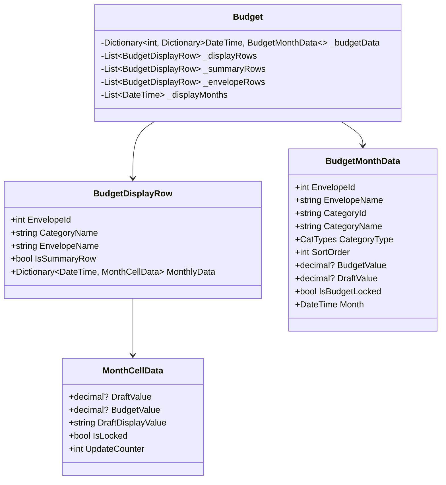
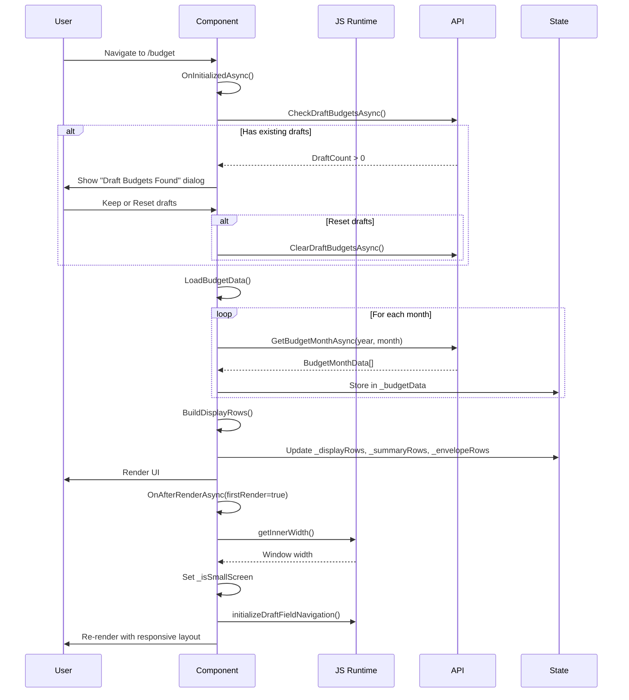
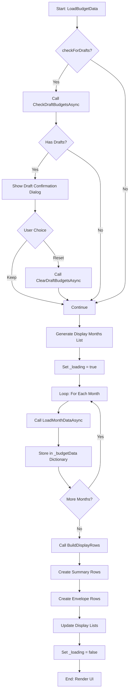
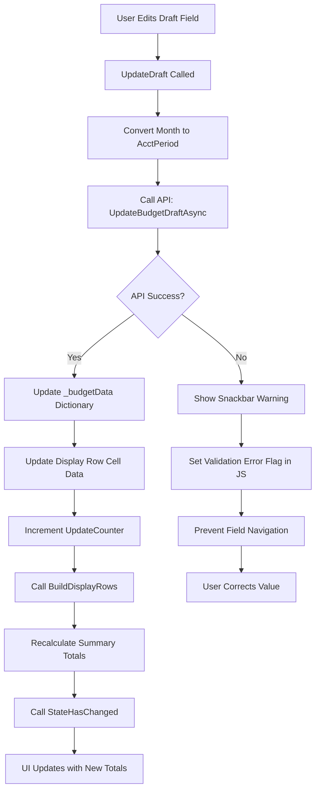
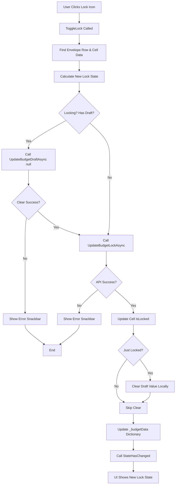
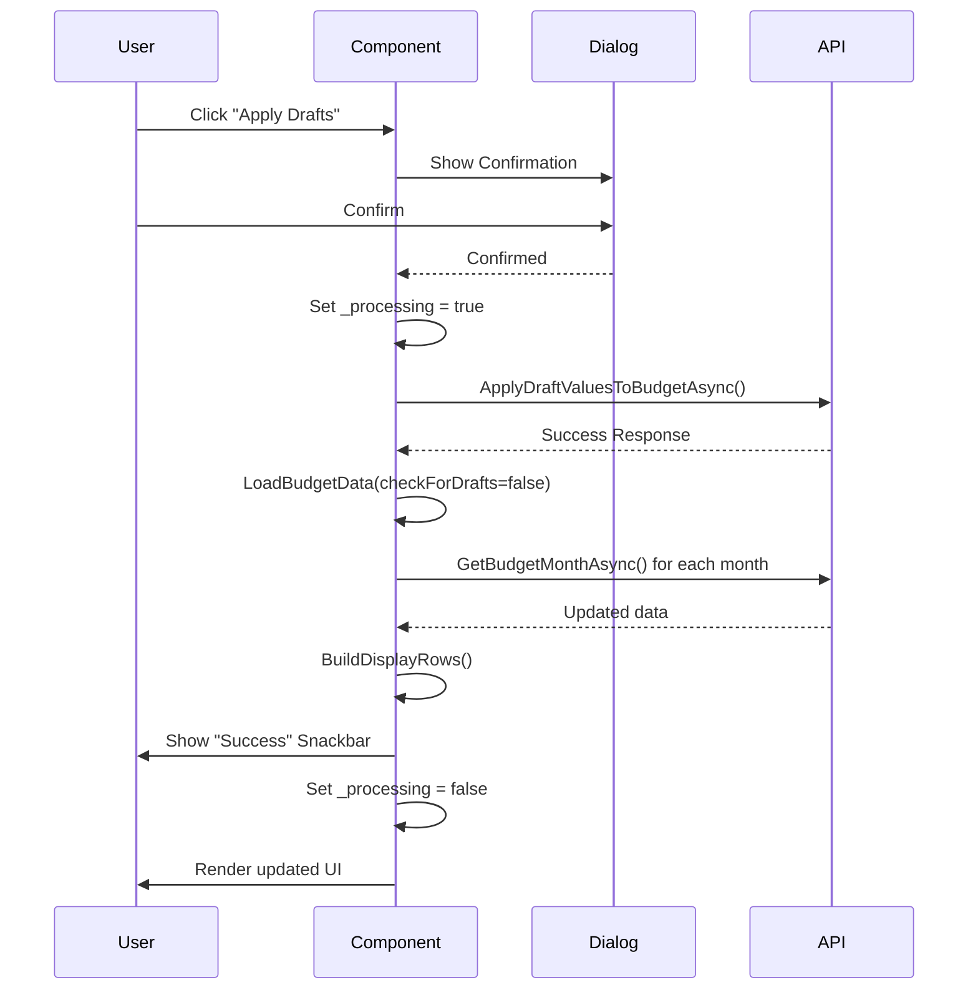
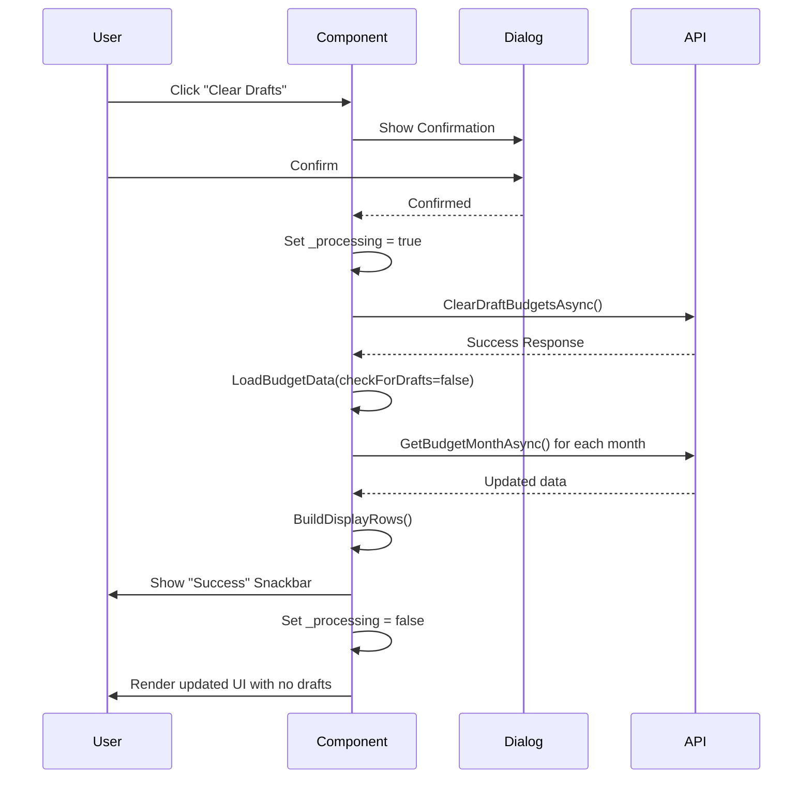
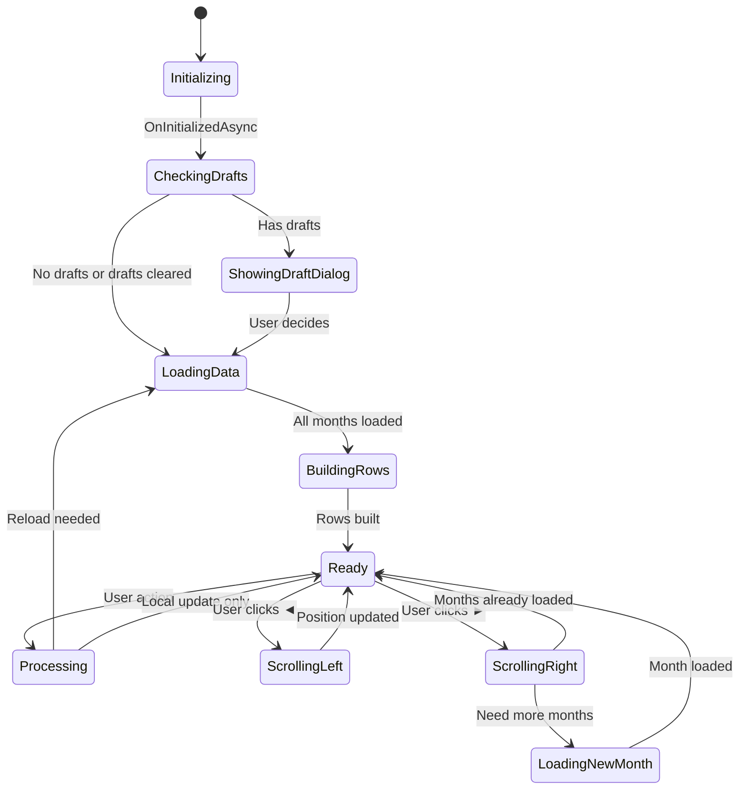
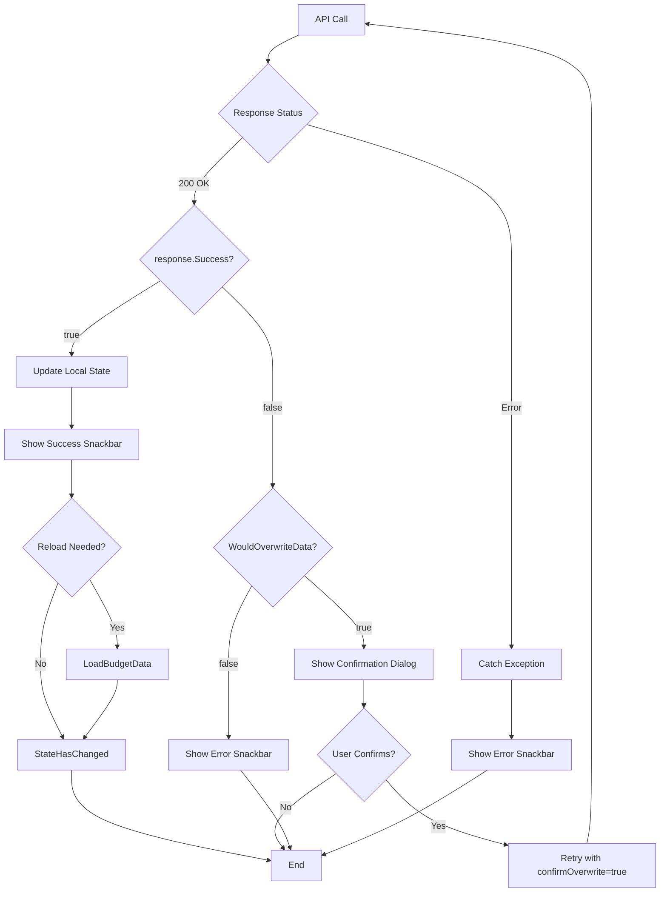
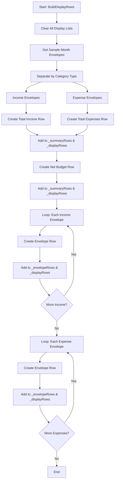

# Budget Page Documentation

## Overview

The Budget page (`Budget.razor` and `Budget.razor.cs`) is a complex Blazor component that provides a comprehensive interface for managing monthly budgets across multiple envelopes (budget categories). It displays budget data in a spreadsheet-like table format, allowing users to view, edit, and manage budget allocations across time.

### Key Features

- **Multi-Month View**: Display 1-3 months of budget data side-by-side (responsive)
- **Dual-Column System**: Budget (committed) and Draft (proposed) values for each month
- **Budget Locking**: Lock individual envelope/month combinations to prevent edits
- **Bulk Operations**: Apply, clear, or copy budget data across months
- **Real-time Updates**: Automatic calculation of totals and summaries
- **Responsive Design**: Adapts to small screens (mobile) and large screens (desktop)
- **Keyboard Navigation**: Full keyboard support for data entry

---

## Architecture

### Component Structure

```
Budget.razor (View)
├── Style definitions
├── Page header with navigation
├── Month scroll controls
├── Action buttons (Clear/Apply Drafts)
├── Fixed table section (Summary rows)
│   ├── Total Income
│   ├── Total Expenses
│   └── Net Budget
└── Scrollable table section (Envelope rows)
    ├── Income envelopes
    └── Expense envelopes

Budget.razor.cs (Code-behind)
├── State management
├── Data loading & transformation
├── User interaction handlers
├── API communication
└── Business logic
```

### Data Model Hierarchy



---

## Component Lifecycle



---

## Data Flow

### Loading Data Flow



### Draft Update Flow



### Lock Toggle Flow



---

## Key Operations

### 1. Apply Drafts

Copies all draft values to their corresponding budget values across all envelopes and months.



**Impact**: 
- All draft values become budget values
- Draft values are cleared
- Locked budgets are not affected

### 2. Clear Drafts

Removes all draft values from the system.



**Impact**:
- All draft values are deleted
- Budget values remain unchanged
- User loses all uncommitted changes

### 3. Copy to Next Month

Copies budget or draft values from one month to the next month.

```mermaid
flowchart TD
    A[User Selects "Copy to Next Month"] --> B[CopyToNextMonth Called]
    B --> C[Validate Month Index]
    C --> D[Convert to AcctPeriod]
    D --> E[Call API: CopyBudgetToNextMonthAsync]
    E --> F{Would Overwrite Data?}
    
    F -->|Yes| G[Show Overwrite Confirmation Dialog]
    G --> H{User Confirms?}
    H -->|No| Z[End: Cancel Operation]
    H -->|Yes| I[Call API with confirmOverwrite=true]
    
    F -->|No| J{API Success?}
    I --> J
    
    J -->|Yes| K[Show Success Snackbar]
    K --> L[LoadBudgetData checkForDrafts=false]
    L --> M[Render Updated UI]
    
    J -->|No| N[Show Error Snackbar]
    N --> Z
```

**Modes**:
- **Copy Draft**: Copies draft values to next month's draft values
- **Copy Budget**: Copies budget values to next month's draft values

### 4. Month Menu Operations

Each month has a dropdown menu with multiple operations:

```mermaid
graph TD
    A[Month Menu "⋮"] --> B[Copy Drafts To Budgets]
    A --> C[Clear All Budgets]
    A --> D[Clear All Drafts]
    A --> E[Clear Both]
    A --> F[Copy Draft to Next Month]
    A --> G[Copy Budget to Next Month]
    
    B --> B1[ApplyMonthDrafts]
    C --> C1[ClearMonthBudgetValues clearBudget=true]
    D --> D1[ClearMonthBudgetValues clearBudget=false]
    E --> E1[ClearMonthBoth]
    F --> F1[CopyToNextMonth copyFromDraft=true]
    G --> G1[CopyToNextMonth copyFromDraft=false]
    
    B1 --> X[Show Confirmation]
    C1 --> X
    D1 --> X
    E1 --> X
    F1 --> X
    G1 --> X
    
    X --> Y[API Call]
    Y --> Z[Reload Data & Render]
```

---

## UI Layout

### Desktop Layout (≥768px)

```
┌─────────────────────────────────────────────────────────────────┐
│ Budget Maintenance                                              │
├─────────────────────────────────────────────────────────────────┤
│ [◄] Oct 2025 - Dec 2025 [►]     [Clear Drafts] [Apply Drafts] │
├─────────────────────────────────────────────────────────────────┤
│ FIXED SECTION (Summary Rows)                                    │
├──────────┬────────┬──────────────┬──────────────┬──────────────┤
│ Category │ Env..  │  Oct 2025 ⋮  │  Nov 2025 ⋮  │  Dec 2025 ⋮  │
│          │ lope   ├───────┬──────┼───────┬──────┼───────┬──────┤
│          │        │Budget │Draft │Budget │Draft │Budget │Draft │
├──────────┼────────┼───────┼──────┼───────┼──────┼───────┼──────┤
│          │ Total  │       │      │       │      │       │      │
│          │ Income │$5,000 │$5,200│$5,000 │$5,200│$5,000 │$5,200│
├──────────┼────────┼───────┼──────┼───────┼──────┼───────┼──────┤
│          │ Total  │       │      │       │      │       │      │
│          │Expenses│$4,500 │$4,800│$4,500 │$4,800│$4,500 │$4,800│
├──────────┼────────┼───────┼──────┼───────┼──────┼───────┼──────┤
│          │  Net   │       │      │       │      │       │      │
│          │ Budget │  $500 │ $400 │  $500 │ $400 │  $500 │ $400 │
├──────────┴────────┴───────┴──────┴───────┴──────┴───────┴──────┤
│ SCROLLABLE SECTION (Envelope Rows)                        ▲     │
├──────────┬────────┬───────┬──────┬───────┬──────┬───────┬──────┤
│ Income   │Salary  │$5,000 │🔓[  ]│$5,000 │🔓[  ]│$5,000 │🔓[  ]│
├──────────┼────────┼───────┼──────┼───────┼──────┼───────┼──────┤
│ Housing  │Rent    │$1,500 │🔓[  ]│$1,500 │🔓[  ]│$1,500 │🔓[  ]│
├──────────┼────────┼───────┼──────┼───────┼──────┼───────┼──────┤
│ Utilities│Electric│  $150 │🔓[  ]│  $150 │🔓[  ]│  $150 │🔓[  ]│
├──────────┼────────┼───────┼──────┼───────┼──────┼───────┼──────┤
│ Food     │Grocery │  $600 │🔓[  ]│  $600 │🔓[  ]│  $600 │🔓[  ]│
├──────────┼────────┼───────┼──────┼───────┼──────┼───────┼──────┤
│ ...more envelopes...                                      │     │
│                                                            ▼     │
└─────────────────────────────────────────────────────────────────┘
```

### Mobile Layout (<768px)

```
┌─────────────────────────────────┐
│ Budget Maintenance              │
├─────────────────────────────────┤
│ [◄] Oct [►]   [Clear] [Apply]  │
├─────────────────────────────────┤
│ FIXED SECTION                   │
├──────────┬──────────────────────┤
│ Category │     Oct 2025 ⋮       │
│          ├──────────┬───────────┤
│ Envelope │  Budget  │   Draft   │
├──────────┼──────────┼───────────┤
│          │          │           │
│ Total    │  $5,000  │  $5,200   │
│ Income   │          │           │
├──────────┼──────────┼───────────┤
│ Total    │  $4,500  │  $4,800   │
│ Expenses │          │           │
├──────────┼──────────┼───────────┤
│ Net      │    $500  │    $400   │
│ Budget   │          │           │
├──────────┴──────────┴───────────┤
│ SCROLLABLE SECTION         ▲    │
├──────────┬──────────┬───────────┤
│ Income   │  $5,000  │🔓   [    ]│
│ Salary   │          │           │
├──────────┼──────────┼───────────┤
│ Housing  │  $1,500  │🔓   [    ]│
│ Rent     │          │           │
├──────────┼──────────┼───────────┤
│ ...more...          │      ▼    │
└─────────────────────────────────┘
```

**Responsive Behavior**:
- Desktop: 3 months visible (configurable via `DefaultScreenColumns`)
- Mobile: 1 month visible
- Buttons show abbreviated text on small screens
- Month headers simplified

---

## State Management

### Primary State Variables

| Variable | Type | Purpose |
|----------|------|---------|
| `_loading` | `bool` | Shows/hides loading progress bar |
| `_processing` | `bool` | Disables UI during operations |
| `_budgetData` | `Dictionary<int, Dictionary<DateTime, BudgetMonthData>>` | Raw budget data indexed by EnvelopeId → Month |
| `_displayRows` | `List<BudgetDisplayRow>` | All rows (summary + envelopes) for rendering |
| `_summaryRows` | `List<BudgetDisplayRow>` | Summary rows only (Income, Expenses, Net) |
| `_envelopeRows` | `List<BudgetDisplayRow>` | Envelope rows only (scrollable section) |
| `_displayMonths` | `List<DateTime>` | Months currently loaded/available |
| `_currentScrollPosition` | `int` | Index of leftmost visible month |
| `_isSmallScreen` | `bool` | Mobile vs desktop layout flag |
| `MonthsToShow` | `int` | Number of months visible (1 or 3) |

### State Transitions



---

## API Integration

### API Endpoints Used

| Endpoint | Method | Purpose |
|----------|--------|---------|
| `CheckDraftBudgetsAsync()` | GET | Check if draft budgets exist |
| `GetBudgetMonthAsync(year, month)` | GET | Load budget data for one month |
| `UpdateBudgetDraftAsync(acctPeriod, envelopeId, value)` | PUT | Update single draft value |
| `UpdateBudgetLockAsync(acctPeriod, envelopeId, locked)` | PUT | Toggle lock state |
| `ClearDraftBudgetsAsync()` | DELETE | Clear all drafts globally |
| `ApplyDraftValuesToBudgetAsync()` | POST | Apply all drafts to budgets |
| `CopyBudgetToNextMonthAsync(acctPeriod, copyFromDraft, confirmOverwrite)` | POST | Copy month to next |
| `ClearMonthBudgetsAsync(acctPeriod)` | DELETE | Clear all budgets for month |
| `ClearMonthDraftsAsync(acctPeriod)` | DELETE | Clear all drafts for month |
| `ClearMonthBothAsync(acctPeriod)` | DELETE | Clear budgets and drafts for month |
| `ApplyMonthDraftsAsync(acctPeriod)` | POST | Apply drafts for one month |

### API Response Handling



---

## User Interactions

### Draft Value Editing

**Trigger**: User types in a draft field

**Flow**:
1. User focuses on `MudNumericField` in Draft column
2. Types new value (or clears field for null)
3. On blur or Enter key, `ValueChanged` fires
4. Component calls `UpdateDraft(envelopeId, month, value)`
5. API validates and saves
6. If valid: Local state updates, summary recalculates, UI refreshes
7. If invalid: Snackbar shows error, field retains focus

**Keyboard Support**:
- Tab: Move to next draft field
- Shift+Tab: Move to previous draft field
- Enter: Commit value and move to next field
- Escape: Revert to original value

**Special Handling**:
- `@key="@cellData.UpdateCounter"`: Forces component recreation on update
- `Immediate="false"`: Waits for blur/enter before updating
- `Disabled="@cellData.IsLocked"`: Prevents editing locked budgets

### Lock Toggle

**Trigger**: User clicks lock icon 🔓/🔒

**Flow**:
1. User clicks lock icon or presses Enter/Space when focused
2. Component calls `ToggleLock(envelopeId, month)`
3. If locking and draft exists: Clear draft first
4. Call API to update lock state
5. Update local state and UI
6. Show locked icon (🔒) or unlocked icon (🔓)

**Rules**:
- Locked budgets cannot have draft values
- Locking a budget with a draft clears the draft
- Unlocking allows draft editing again

### Month Scrolling

**Left Arrow (◄)**:
- Decrements `_currentScrollPosition`
- Shows previous months
- Disabled when at position 0

**Right Arrow (►)**:
- Increments `_currentScrollPosition`
- Shows next months
- Automatically loads new months if needed (lazy loading)

### Bulk Operations

All bulk operations follow this pattern:
1. User triggers action (button or menu)
2. Confirmation dialog appears
3. If confirmed:
   - Set `_processing = true` (disables UI)
   - Call API
   - Show success/error snackbar
   - Reload data
   - Set `_processing = false`
4. If canceled: No action

---

## Display Row Construction

### BuildDisplayRows() Algorithm



### Summary Row Calculation

**Total Income**:
```csharp
Sum of all Budget/Draft values where CategoryType == CatTypes.Income
```

**Total Expenses**:
```csharp
Sum of all Budget/Draft values where CategoryType == CatTypes.User
```

**Net Budget**:
```csharp
(Total Income Budget - Total Expenses Budget, 
 Total Income Draft - Total Expenses Draft)
```

---

## JavaScript Interop

### Functions Used

1. **Window Size Detection**
   ```javascript
   windowUtils.getInnerWidth()
   ```
   - Returns: `int` (window width in pixels)
   - Used: Determine mobile vs desktop layout

2. **Draft Field Navigation**
   ```javascript
   initializeDraftFieldNavigation()
   ```
   - Sets up Tab/Enter keyboard navigation between draft fields
   - Called: After first render

3. **Validation Error Flag**
   ```javascript
   setValidationError(true/false)
   ```
   - Prevents field navigation when validation fails
   - Called: After API validation error

---

## Styling

### Key CSS Classes

| Class | Purpose |
|-------|---------|
| `.draft-input-right` | Right-align draft input fields |
| `.budget-tables-wrapper` | Flex container for fixed + scrollable sections |
| `.budget-fixed-section` | Non-scrolling header with summary rows |
| `.budget-scrollable-section` | Scrolling envelope rows |
| `.budget-fixed-table` | MudTable styling for fixed section |
| `.budget-scrollable-table` | MudTable styling for scrollable section (hides header) |
| `.lock-icon` | Size and style for lock/unlock icons |
| `.budget-with-lock` | Flex container for budget value + lock icon |
| `.envelope-column` | Fixed width for envelope name column |
| `.category-column` | Fixed width for category name column |

### Layout Strategy

**Fixed + Scrollable Split**:
- Fixed section: Summary rows always visible
- Scrollable section: Envelope rows can scroll independently
- Both sections share column alignment via `table-layout: fixed`

**Column Borders**:
- Each month has a left border (`border-left: 2px solid`)
- Visually separates months

**Responsive Typography**:
- Desktop: Full text, larger fonts
- Mobile: Abbreviated text, smaller fonts

---

## Performance Considerations

### Optimization Techniques

1. **Lazy Month Loading**
   - Only loads visible months initially
   - Loads additional months when scrolling right
   - Avoids loading 12+ months upfront

2. **Selective Re-renders**
   - `@key="@cellData.UpdateCounter"` forces targeted updates
   - `StateHasChanged()` called only when needed
   - Draft updates don't rebuild entire row structure (commented out)

3. **Local State Updates**
   - Updates `_budgetData` dictionary immediately
   - Reflects in UI without API round-trip for display
   - Background API call syncs server state

4. **Component Reuse**
   - `BuildDisplayRows()` reuses existing row objects
   - Only rebuilds when structure changes (envelopes added/removed)

### Potential Bottlenecks

1. **Large Envelope Count**
   - Scrollable section can have 50+ rows
   - MudTable renders all rows (no virtualization)
   - **Mitigation**: CSS overflow scrolling, dense tables

2. **Multiple API Calls**
   - Each month loads separately
   - **Mitigation**: Async loading with progress indicator

3. **Bulk Operations**
   - Apply/Clear drafts process all envelopes
   - **Mitigation**: `_processing` flag shows loading state

---

## Error Handling

### API Error Handling

```csharp
try
{
    var response = await ApiCall();
    if (response.Success)
    {
        // Handle success
    }
    else
    {
        Snackbar.Add(response.Message ?? "Error", Severity.Error);
    }
}
catch (Exception ex)
{
    Snackbar.Add($"Error: {ex.Message}", Severity.Error);
}
finally
{
    _processing = false;
    StateHasChanged();
}
```

**User Feedback**:
- All errors shown via MudBlazor Snackbar
- Error severity: `Severity.Error` (red)
- Warning severity: `Severity.Warning` (orange)
- Success severity: `Severity.Success` (green)

### Validation Errors

**Draft Input Validation**:
- API validates draft values (e.g., non-negative, reasonable range)
- Invalid values show warning snackbar
- JavaScript flag prevents field navigation
- User must correct value before proceeding

### Defensive Checks

- Bounds checking on month indices
- Null checks on cell data
- Dictionary `TryGetValue()` instead of direct indexing
- Fallback to default values when data missing

---

## Testing Considerations

### Unit Test Scenarios

1. **Data Loading**
   - Load multiple months
   - Handle empty responses
   - Handle API errors

2. **Draft Updates**
   - Update valid value
   - Update to null (clear)
   - Handle validation errors
   - Verify summary recalculation

3. **Lock Toggle**
   - Lock unlocked budget
   - Unlock locked budget
   - Lock budget with draft (should clear draft)

4. **Bulk Operations**
   - Apply all drafts
   - Clear all drafts
   - Copy to next month (with/without overwrite)
   - Per-month operations

5. **Navigation**
   - Scroll left/right
   - Lazy load new months
   - Boundary conditions

### Integration Test Scenarios

1. **End-to-End Workflows**
   - Load page → Edit drafts → Apply drafts → Verify budgets
   - Load page → Copy month → Verify next month
   - Load page → Lock budget → Verify cannot edit draft

2. **Responsive Behavior**
   - Test on mobile viewport
   - Test on desktop viewport
   - Verify correct number of columns

3. **JavaScript Interop**
   - Verify keyboard navigation works
   - Verify validation error handling

---

## Future Enhancement Ideas

1. **Virtualized Scrolling**
   - Use `MudVirtualize` for large envelope lists
   - Render only visible rows

2. **Inline Editing for Budgets**
   - Allow editing committed budgets (with confirmation)
   - Track edit history/audit log

3. **Excel-like Features**
   - Fill down (copy value to all months below)
   - Formula support (e.g., "10% of income")
   - Copy/paste multiple cells

4. **Advanced Filtering**
   - Show only income or expense envelopes
   - Filter by category
   - Search envelope names

5. **Undo/Redo**
   - Stack of previous states
   - Ctrl+Z / Ctrl+Y support

6. **Customizable Columns**
   - Choose which months to display
   - Non-contiguous month selection
   - Compare year-over-year

7. **Bulk Import/Export**
   - CSV import for budgets
   - Excel export of current view

8. **Budget Templates**
   - Save/load budget templates
   - Apply template to multiple months

---

## Dependencies

### NuGet Packages
- `MudBlazor` - UI component library
- `Microsoft.JSInterop` - JavaScript interop

### Injected Services
- `IBudgetMonthlyApiClient` - Budget API client
- `IDialogService` - MudBlazor dialog service
- `ISnackbar` - MudBlazor snackbar service
- `IJSRuntime` - JavaScript runtime

### Custom Types
- `BudgetMonthData` (from API responses)
- `CatTypes` enum (Income, User, System)
- `AcctPeriodHelper` (date conversion utilities)

---

## Code Metrics

- **Total Lines**: ~900
- **Methods**: 20+
- **Nested Classes**: 3
- **API Calls**: 11 different endpoints
- **State Variables**: 10+
- **Render Sections**: 2 (fixed + scrollable)

---

## Maintenance Notes

### Common Modifications

1. **Change Number of Visible Months**
   - Modify `DefaultScreenColumns` constant

2. **Add New Bulk Operation**
   - Add menu item in month header
   - Implement handler method
   - Add confirmation dialog
   - Call API endpoint
   - Reload data

3. **Customize Summary Rows**
   - Modify `BuildDisplayRows()`
   - Add new summary calculation logic
   - Add new row to `_summaryRows`

4. **Change Responsive Breakpoint**
   - Modify `SmallScreenBreakpoint` constant

### Breaking Change Risks

1. **API Response Structure Changes**
   - `BudgetMonthData` properties
   - Response wrapper changes
   - Will require code updates

2. **MudBlazor Version Updates**
   - Component API changes
   - Style class changes
   - May require template updates

3. **JavaScript Function Changes**
   - Rename/remove JS functions
   - Will break interop calls

---

## Troubleshooting Guide

### Issue: Drafts Not Saving

**Symptoms**: User edits draft, but value reverts

**Possible Causes**:
1. API validation failure (check snackbar)
2. JavaScript validation error flag set
3. Network error (check browser console)
4. Budget is locked

**Debug Steps**:
1. Check browser Network tab for API response
2. Check for error snackbar messages
3. Verify budget is not locked
4. Check `UpdateDraft()` method

### Issue: Summary Totals Wrong

**Symptoms**: Total Income/Expenses don't match sum of rows

**Possible Causes**:
1. `BuildDisplayRows()` not called after update
2. Envelope not in `_budgetData` dictionary
3. Month not in envelope's month dictionary
4. Draft vs Budget column confusion (drafts not included in budget totals)

**Debug Steps**:
1. Add breakpoint in `CalculateTotals()`
2. Verify all envelopes present
3. Check `_budgetData` structure
4. Verify `BuildDisplayRows()` called after state change

### Issue: Lock Icon Not Working

**Symptoms**: Clicking lock doesn't change state

**Possible Causes**:
1. API call failing
2. Row not in `_envelopeRows` (summary rows don't have locks)
3. Cell data not found in `MonthlyData` dictionary

**Debug Steps**:
1. Check browser console for errors
2. Add breakpoint in `ToggleLock()`
3. Verify `envelopeId` and `month` are correct
4. Check API response

### Issue: Scroll Not Loading New Months

**Symptoms**: Clicking right arrow (►) doesn't load new months

**Possible Causes**:
1. `LoadMonthDataAsync()` failing silently
2. Exception caught and logged to snackbar
3. API endpoint not returning data

**Debug Steps**:
1. Add breakpoint in `ScrollRight()`
2. Verify `_displayMonths` growing
3. Check Network tab for API calls
4. Check snackbar for error messages

---

## Accessibility

### Keyboard Support

- **Tab Navigation**: Move between draft fields
- **Enter**: Submit draft value
- **Space/Enter on Lock**: Toggle lock state
- **Escape**: Cancel edit (planned)

### Screen Reader Support

- `alt` attributes on lock icons
- `role="button"` on clickable icons
- `tabindex="0"` on focusable elements
- `aria-label` on menu button

### Visual Indicators

- Lock icons show state clearly
- Error messages via snackbar
- Loading indicator via progress bar
- Disabled state on locked fields

---

## Security Considerations

1. **Authorization**
   - Page requires authentication (`@rendermode InteractiveServer`)
   - API validates user permissions
   - User can only access their own budgets

2. **Input Validation**
   - API validates all draft values
   - Server-side validation prevents malicious input
   - Client-side validation provides feedback

3. **CSRF Protection**
   - Blazor Server provides automatic CSRF protection
   - SignalR connection authenticated

---

## Related Components

- **EnvelopePage**: Manage envelope definitions
- **Fund**: Allocate actual funds to envelopes
- **Assign**: Assign transactions to envelopes
- **ConfirmationDialog**: Reusable confirmation dialog
- **DraftConfirmationDialog**: Draft-specific confirmation

---

## Revision History

| Version | Date | Changes |
|---------|------|---------|
| 1.0 | Current | Initial documentation |

---

## Quick Reference

### Most Common User Tasks

1. **Edit a draft budget**
   - Click in draft field
   - Type amount
   - Press Enter or Tab

2. **Apply all drafts**
   - Click "Apply Drafts" button
   - Confirm dialog

3. **Lock a budget**
   - Click lock icon next to budget value
   - Icon changes to 🔒

4. **Copy budget to next month**
   - Click month menu (⋮)
   - Select "Copy Budget to Next Month"
   - Confirm if overwriting

5. **View different months**
   - Click ◄ or ► arrows
   - New months load automatically

### Most Common Developer Tasks

1. **Add new API endpoint**
   - Add method to `IBudgetMonthlyApiClient`
   - Call in component method
   - Handle response

2. **Add new bulk operation**
   - Add menu item in `HeaderContent`
   - Implement handler method
   - Show confirmation dialog
   - Call API and reload

3. **Modify summary calculations**
   - Edit `CalculateTotals()` method
   - Update `CreateSummaryRow()` logic
   - Test with various scenarios

4. **Change layout**
   - Modify CSS in `<style>` section
   - Test responsive breakpoints
   - Verify table alignment

---

## Conclusion

The Budget page is a sophisticated component that balances complexity with usability. It provides a powerful spreadsheet-like interface for budget management while maintaining clean separation between view and logic, proper error handling, and responsive design.

Key strengths:
- ✅ Comprehensive feature set
- ✅ Good separation of concerns
- ✅ Robust error handling
- ✅ Responsive design
- ✅ Keyboard accessibility

Areas for enhancement:
- ⚠️ Could benefit from virtualized scrolling for large datasets
- ⚠️ Undo/redo functionality would improve UX
- ⚠️ More comprehensive unit test coverage needed
