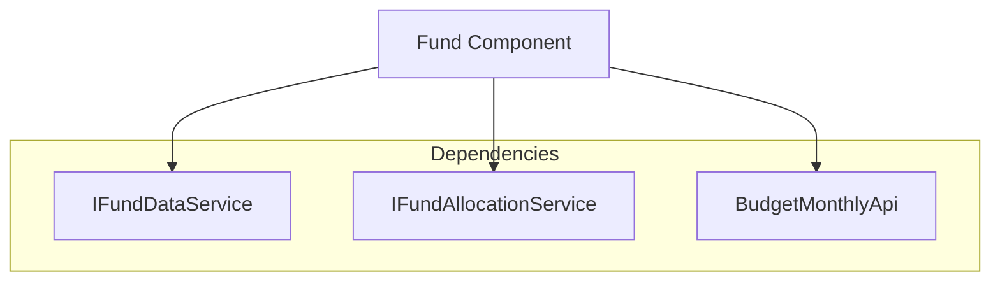
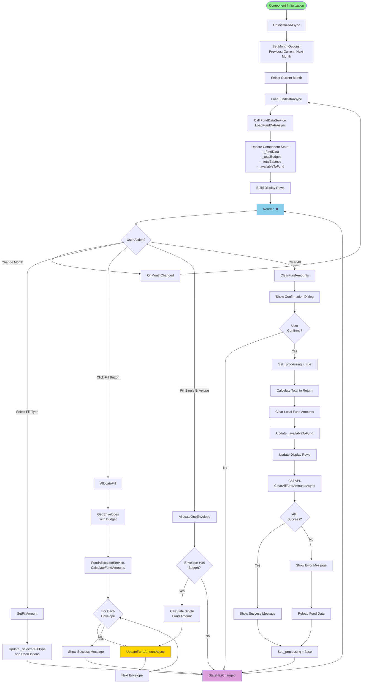
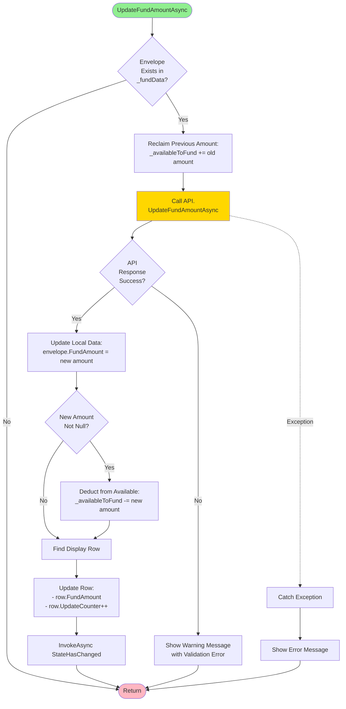
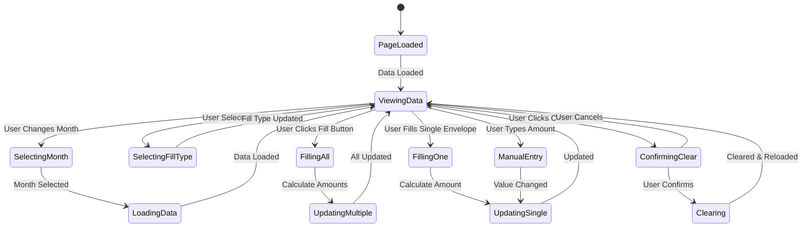

# Fund Page Logic Flow

This document describes the logic flow of the `Fund.razor.cs` component, which manages budget envelope funding operations.

## Overview

The Fund page allows users to allocate funding amounts to budget envelopes for a specific month. Users can:
- View envelopes with their budgets and current balances
- Select different months to fund
- Apply fill percentages (25%, 50%, 75%, 100%) to automatically calculate funding amounts
- Manually adjust individual envelope funding amounts
- Clear all fund amounts

## Component Architecture

## Main Logic Flow

## Update Fund Amount Flow

## Key State Variables

| Variable | Type | Purpose |
|----------|------|---------|
| `_loading` | bool | Indicates data is being loaded |
| `_processing` | bool | Indicates an operation is in progress |
| `_fundData` | Dictionary<int, FundEnvelopeData> | Core data for all envelopes |
| `_envelopeRows` | List<FundDisplayRow> | Display-optimized row data |
| `_monthOptions` | List<DateTime> | Available months for selection |
| `_selectedMonth` | DateTime | Currently selected month |
| `_selectedFillType` | FillAmounts | Current fill percentage preset |
| `_totalBudget` | decimal | Sum of all envelope budgets |
| `_totalBalance` | decimal | Sum of all envelope balances |
| `_availableToFund` | decimal | Remaining funds available for allocation |

## Service Dependencies

### IFundDataService
- **LoadFundDataAsync**: Loads envelope fund data for a specific month
- **BuildDisplayRows**: Transforms fund data into display rows

### IFundAllocationService
- **CalculateFundAmounts**: Calculates fund amounts for multiple envelopes based on fill percentage
- **CalculateFundAmount**: Calculates fund amount for a single envelope

### BudgetMonthlyApi
- **UpdateFundAmountAsync**: Persists a single envelope's fund amount
- **ClearAllFundAmountsAsync**: Clears all fund amounts for the month

## User Interactions

## Error Handling

- **LoadFundDataAsync**: Uses try-finally to ensure `_loading` is set to false
- **UpdateFundAmountAsync**: Catches exceptions and shows error messages
- **ClearFundAmounts**: On API failure, reloads data to restore previous state
- **AllocateFill**: Relies on UpdateFundAmountAsync error handling for each envelope

## Performance Optimizations

1. **Display Row Updates**: Individual row updates prevent full table rebuild, avoiding focus loss in input fields
2. **UpdateCounter**: Forces MudNumericField recreation for proper formatting without full render
3. **State Management**: Tracks `_processing` to disable UI during operations
4. **Lazy Loading**: Data loaded only when month changes
