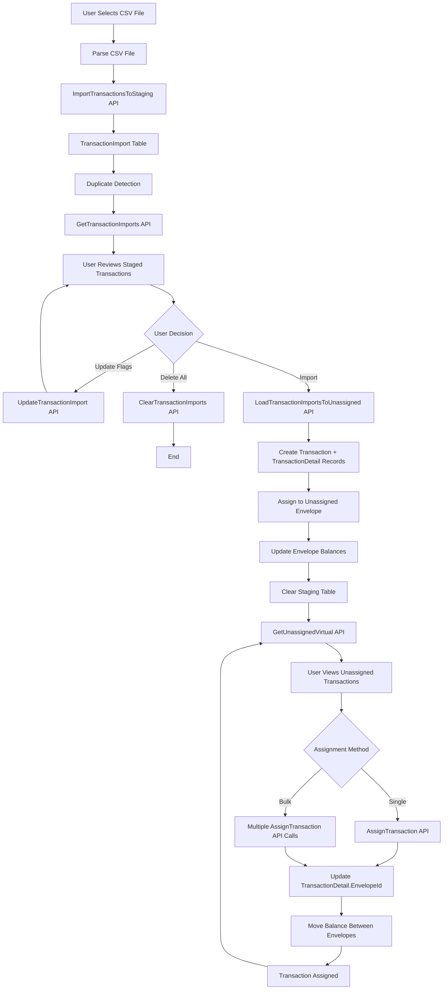

# Transaction Import and Assignment Process - Technical Documentation

## Overview

This document provides a technical overview of the CSV import and transaction assignment process, focusing on the API endpoints, entity classes, and DTOs involved. This complements the user-facing documentation by detailing the backend data flow.

## Table of Contents

- [Overview](#overview)
- [Process Flow Summary](#process-flow-summary)
- [Phase A: CSV Import to Staging](#phase-a-csv-import-to-staging)
  - [Step 1: Import CSV to Staging Table](#step-1-import-csv-to-staging-table)
  - [Step 2: Reload Staged Transactions](#step-2-reload-staged-transactions)
  - [Step 3: Update Duplicate Flags](#step-3-update-duplicate-flags)
  - [Step 4: Load to Transactions Tables](#step-4-load-to-transactions-tables)
  - [Step 5: Clear Staging Table](#step-5-clear-staging-table)
- [Phase B: Transaction Assignment](#phase-b-transaction-assignment)
  - [Step 1: Load Unassigned Transactions](#step-1-load-unassigned-transactions)
  - [Step 2: Load Available Envelopes](#step-2-load-available-envelopes)
  - [Step 3: Single Transaction Assignment](#step-3-single-transaction-assignment)
  - [Step 4: Bulk Transaction Assignment](#step-4-bulk-transaction-assignment)
- [Database Schema](#database-schema)
  - [TransactionImport (Staging Table)](#transactionimport-staging-table)
  - [Transaction (Main Table)](#transaction-main-table)
  - [TransactionDetail (Line Items)](#transactiondetail-line-items)
  - [Envelope (Budget Categories)](#envelope-budget-categories)
- [Data Transfer Objects (DTOs)](#data-transfer-objects-dtos)
  - [TransactionImportDto](#transactionimportdto)
  - [TransactionDto](#transactiondto)
  - [TransactionDetailDto](#transactiondetaildto)
  - [OneTransactionDetail](#onetransactiondetail)
  - [EnvelopeIdName](#envelopeidname)
  - [AssignQuery](#assignquery)
  - [AssignQueryResult](#assignqueryresult)
- [API Endpoints Reference](#api-endpoints-reference)
  - [Import Endpoints](#import-endpoints)
  - [Assignment Endpoints](#assignment-endpoints)
  - [Envelope Endpoints](#envelope-endpoints)
- [Business Logic Details](#business-logic-details)
  - [Duplicate Detection](#duplicate-detection)
  - [Vendor Extraction](#vendor-extraction)
  - [Balance Updates](#balance-updates)
  - [Envelope Balance Trigger](#envelope-balance-trigger)
- [Error Handling](#error-handling)
- [Performance Considerations](#performance-considerations)
- [Security Considerations](#security-considerations)
- [Related Documentation](#related-documentation)

---

## Process Flow Summary



---

## Phase A: CSV Import to Staging

### Step 1: Import CSV to Staging Table

**Component**: `TransactionsCsvImport.razor.cs`
**API Endpoint**: `POST /api/transactions/import`
**Handler**: `ImportTransactionsToStaging.Handler`

**Flow**:
1. User selects CSV file in browser
2. Component reads file using `InputFileChangeEventArgs`
3. Component parses CSV using custom `ParseCsvLine()` method
4. Component maps CSV rows to `List<TransactionImportDto>`
5. Component calls `Api.ImportTransactionsToStagingAsync(transactionsToImport)`
6. API receives `Command(List<TransactionImportDto>)`

**API Handler Logic**:
```csharp
public async Task<int> Handle(Command request, CancellationToken cancellationToken)
{
    var familyId = currentFamilyService.GetCurrentFamilyId();

    // Convert DTOs to entities
    var entities = request.Transactions.Select(dto => new TransactionImport
    {
        Date = dto.Date,
        PostingStatus = dto.PostingStatus,
        Vendor = dto.Vendor,
        Description = RemoveConsecutiveSpaces(dto.Description),
        Notes = dto.Notes,
        Amount = dto.Amount,
        EnvelopeId = dto.EnvelopeId,
        EnvelopeName = dto.EnvelopeName,
        UserId = dto.UserId,
        FamilyId = familyId,
        ImportedAt = DateTime.UtcNow,
        Duplicate = false
    }).ToList();

    // Extract vendor from description if vendor is empty
    SetVendor(entities);

    // Bulk insert to staging table
    db.TransactionImports.AddRange(entities);
    await db.SaveChangesAsync(cancellationToken);

    // Detect duplicates
    await DetectDuplicatesAsync(entities, cancellationToken);

    return entities.Count;
}
```

**Key Business Logic**:
- **Vendor Extraction**: If `Vendor` is empty, extracts vendor from beginning of `Description`
- **Duplicate Detection**: Compares against existing `Transactions` table by Date, Vendor, and Amount
- **Family Scoping**: Associates imports with current family

**Input DTO**: `TransactionImportDto`
```csharp
public class TransactionImportDto
{
    public int Id { get; set; }
    public DateTime Date { get; set; }
    public PostingStatuses PostingStatus { get; set; }
    public string Vendor { get; set; } = string.Empty;
    public string Description { get; set; } = string.Empty;
    public string Notes { get; set; } = string.Empty;
    public decimal Amount { get; set; }
    public int EnvelopeId { get; set; }
    public string EnvelopeName { get; set; } = string.Empty;
    public int UserId { get; set; }
    public DateTime ImportedAt { get; set; }
    public bool Duplicate { get; set; } = false;
    public bool KeepDuplicate { get; set; }
    public bool NotDuplicate { get; set; }
}
```

**Output**: `int` (count of imported records)

---

### Step 2: Reload Staged Transactions

**Component**: `TransactionsCsvImport.razor.cs`
**API Endpoint**: `GET /Transaction/Import`
**Handler**: `GetTransactionImports.Handler`

**Flow**:
1. After successful import, component calls `LoadPreviewAsync()`
2. Component calls `Api.GetTransactionImportsAsync()`
3. API queries `TransactionImports` table

**API Handler Logic**:
```csharp
public async Task<List<TransactionImportDto>> Handle(Query request, CancellationToken cancellationToken)
{
    var imports = await db.TransactionImports
        .OrderBy(t => t.Date)
        .ProjectToType<TransactionImportDto>()
        .ToListAsync(cancellationToken);

    return imports;
}
```

**Key Features**:
- Orders by Date for chronological display
- Uses Mapster's `ProjectToType<T>()` for efficient DTO mapping
- Returns all staged transactions for current family (filtered by family in query)

**Output**: `List<TransactionImportDto>`

---

### Step 3: Update Duplicate Flags

**Component**: `TransactionsCsvImport.razor.cs`
**API Endpoint**: `PUT /Transaction/Import/{id}`
**Handler**: `UpdateTransactionImport.Handler`

**Flow**:
1. User toggles `KeepDuplicate` checkbox in UI
2. Component calls `Api.UpdateTransactionImportAsync(import.Id, import.Duplicate, import.KeepDuplicate)`
3. API updates single record in `TransactionImports` table

**API Handler Logic**:
```csharp
public async Task<bool> Handle(Command request, CancellationToken cancellationToken)
{
    var import = await db.TransactionImports
        .FirstOrDefaultAsync(t => t.Id == request.Id, cancellationToken);

    if (import == null)
        return false;

    import.Duplicate = request.Duplicate;
    import.KeepDuplicate = request.KeepDuplicate;

    await db.SaveChangesAsync(cancellationToken);

    return true;
}
```

**Input**: `Command(int Id, bool Duplicate, bool KeepDuplicate)`
**Output**: `bool` (success/failure)

---

### Step 4: Load to Transactions Tables

**Component**: `TransactionsCsvImport.razor.cs`
**API Endpoint**: `POST /api/transactions/load-imports`
**Handler**: `LoadTransactionImportsToUnassigned.Handler`

**Flow**:
1. User clicks "Import" button
2. Component filters non-duplicates: `Preview.Where(p => !p.Duplicate || (p.Duplicate && p.KeepDuplicate))`
3. Component calls `Api.LoadTransactionImportsToUnassignedAsync(SelectedAccountId, userId)`
4. API processes each staged transaction

**API Handler Logic**:
```csharp
public async Task<Response> Handle(Command request, CancellationToken cancellationToken)
{
    // Get the Unassigned envelope
    var unassigned = await GetEnvelopeByType.Get(db, EnvelopeTypes.Unassigned, cancellationToken) 
        ?? throw new InvalidOperationException("Unassigned envelope not found");

    // Get non-duplicate transaction imports
    var nonDuplicates = await db.TransactionImports
        .Where(ti => !ti.Duplicate || ti.KeepDuplicate)
        .ToListAsync(cancellationToken);

    if (nonDuplicates.Count == 0)
        return new Response(0);

    List<OneTransactionDetail> transactionsToAdd = [];

    // Process each transaction import
    foreach (var rec in nonDuplicates)
    {
        var trans = new OneTransactionDetail
        {
            AccountId = request.AccountId,
            Date = rec.Date,
            Vendor = rec.Vendor,
            Description = rec.Description,
            UserId = request.UserId,
            UserName = string.Empty,
            WasPotentialDuplicate = rec.KeepDuplicate,
            Details =
            [
                new TransactionDetailDto
                {
                    TransactionId = 0,
                    LineId = 0,
                    EnvelopeId = unassigned.Id,
                    Amount = rec.Amount,
                    Notes = rec.Notes
                }
            ]
        };

        transactionsToAdd.Add(trans);
    }

    // Use AddMultipleTransaction to insert all transactions
    await sender.Send(new AddMultipleTransaction.Command(transactionsToAdd), cancellationToken);

    // Clear the staging table after successful import
    var importedCount = nonDuplicates.Count;
    db.TransactionImports.RemoveRange(nonDuplicates);
    await db.SaveChangesAsync(cancellationToken);

    return new Response(importedCount);
}
```

**Key Steps**:
1. Retrieves "Unassigned" envelope (system envelope type)
2. Filters non-duplicate imports
3. Converts each `TransactionImport` to `OneTransactionDetail`
4. Calls `AddMultipleTransaction.Command` to insert all transactions
5. Clears staging table

**Nested Command**: `AddMultipleTransaction.Command`
**Handler**: `InsertTransactions.AddMultipleTransactions()`

**Insert Logic**:
```csharp
public async Task<TransactionAddResult> AddMultipleTransactions(List<OneTransactionDetail> list)
{
    await BeginBatchAsync();

    foreach (var tran in list)
    {
        await AddTransactionAsync(tran);
    }

    await UpdateEnvelopeBalancesAsync();
    await EndBatchAsync();
    return _InsertTransactionResult;
}

private async Task<Transaction> AddTransactionAsync(OneTransactionDetail tran)
{
    var trans = new Transaction
    {
        AccountId = tran.AccountId,
        Date = tran.Date,
        Vendor = tran.Vendor,
        Description = tran.Description,
        FamilyId = _currentFamilyService.GetCurrentFamilyId(),
        UserId = tran.UserId,
        WasPotentialDuplicate = tran.WasPotentialDuplicate,
        TransactionType = tran.TransactionType
    };

    var lineId = 1;

    foreach (var detail in tran.Details)
    {
        var dtl = new TransactionDetail()
        {
            LineId = lineId++,
            Amount = detail.Amount,
            EnvelopeId = detail.EnvelopeId,
            Notes = detail.Notes
        };

        trans.TotalAmount += detail.Amount;
        trans.Details.Add(dtl);
        _envelopeChanges.Add(new EnvelopeUpdate(detail.EnvelopeId, detail.Amount));
    }

    _transactions.Add(trans);
    await UpdateAccountAsync(trans);

    return trans;
}
```

**Database Changes**:
1. **Transaction** record created in `Transactions` table
2. **TransactionDetail** record(s) created in `TransactionDetails` table
3. **Envelope** balance updated (Unassigned envelope balance increased)
4. **BankAccount** balance and last transaction date updated

**Input**: `Command(int AccountId, int UserId)`
**Output**: `Response(int ImportedCount)`

---

### Step 5: Clear Staging Table

**Component**: `TransactionsCsvImport.razor.cs`
**API Endpoint**: `DELETE /Transaction/Import`
**Handler**: `ClearTransactionImports.Handler`

**Flow**:
1. User clicks "Delete Staged Transactions" button
2. Component calls `Api.ClearTransactionImportsAsync()`
3. API deletes all records from `TransactionImports` table

**API Handler Logic**:
```csharp
public async Task<int> Handle(Command request, CancellationToken cancellationToken)
{
    var imports = await db.TransactionImports.ToListAsync(cancellationToken);
    var count = imports.Count;
    
    if (count > 0)
    {
        db.TransactionImports.RemoveRange(imports);
        await db.SaveChangesAsync(cancellationToken);
    }
    
    return count;
}
```

**Output**: `int` (count of deleted records)

---

## Phase B: Transaction Assignment

### Step 1: Load Unassigned Transactions

**Component**: `Assign.razor.cs`
**API Endpoint**: `POST /transactions/unassigned/virtual`
**Handler**: `GetUnassignedVirtual.Handler`

**Flow**:
1. Component implements server-side data grid (`MudDataGrid` with `ServerData`)
2. Grid calls `LoadServerData(GridState<TransactionDto> gridState)`
3. Component builds `AssignQuery` from `GridState`
4. Component calls `Api.GetUnassignedVirtualAsync(query)`
5. API applies filters, sorting, and pagination

**API Handler Logic**:
```csharp
public async Task<Result<Response>> Handle(Query request, CancellationToken cancellationToken)
{
    var unassignedEnvelope = await GetEnvelopeByType.Get(db, EnvelopeTypes.Unassigned, cancellationToken);

    if (unassignedEnvelope is null)
        return Result.FailIf(unassignedEnvelope == null, "System Error: UnassignedEnvelope not defined");

    var query = (from td in db.TransactionDetails
        join t in db.Transactions on td.TransactionId equals t.Id
        join e in db.Envelopes on td.EnvelopeId equals e.Id
        where td.EnvelopeId == unassignedEnvelope.Id
        select new TransactionDto
        {
            TransactionId = t.Id,
            LineId = td.LineId,
            PostingStatus = t.PostingStatus,
            EnvelopeId = e.Id,
            EnvelopeName = e.Name,
            Vendor = t.Vendor,
            Description = td.Notes,
            Amount = td.Amount,
            Date = t.Date
        }).AsNoTracking();

    // Apply filters
    query = query.ApplyFilters(request.AssignQuery.Filters);

    // Apply sorting
    if (!string.IsNullOrEmpty(request.AssignQuery.Sort))
    {
        query = request.AssignQuery.Descending
            ? query.OrderByDescendingDynamic(request.AssignQuery.Sort)
            : query.OrderByDynamic(request.AssignQuery.Sort);
    }

    var totalCount = await query.CountAsync(cancellationToken);
    
    // Apply pagination
    query = query
        .Skip(request.AssignQuery.StartIndex)
        .Take(request.AssignQuery.Count);

    var items = await query.ToListAsync(cancellationToken);

    var result = new AssignQueryResult
    {
        Items = items,
        TotalCount = totalCount
    };

    return Result.Ok(new Response(result));
}
```

**Key Features**:
- **Server-Side Processing**: Filtering, sorting, and pagination done on database
- **Dynamic Sorting**: Uses `OrderByDynamic()` extension for property name-based sorting
- **Dynamic Filtering**: Uses `ApplyFilters()` extension for flexible filtering
- **Efficient Querying**: Uses `AsNoTracking()` for read-only queries

**Input**: `AssignQuery`
```csharp
public class AssignQuery
{
    public int StartIndex { get; set; }
    public int Count { get; set; }
    public string? Sort { get; set; }
    public bool Descending { get; set; }
    public List<FilterItem>? Filters { get; set; }
}

public class FilterItem
{
    public string? Column { get; set; }
    public string? Operator { get; set; }
    public string? Value { get; set; }
}
```

**Output**: `AssignQueryResult`
```csharp
public class AssignQueryResult
{
    public List<TransactionDto> Items { get; set; }
    public int TotalCount { get; set; }
}
```

---

### Step 2: Load Available Envelopes

**Component**: `Assign.razor.cs`
**API Endpoints**: 
- `GET /envelopes` (GetEnvelopes)
- `GET /categories` (GetCategories)

**Flow**:
1. Component calls `EnvelopesApi.GetEnvelopesAsync()` during initialization
2. Component calls `CategoriesApi.GetCategoriesAsync()` during initialization
3. Component joins envelopes with categories using LINQ
4. Component filters for `EnvelopeTypes.Standard` and `EnvelopeTypes.Income` only
5. Component stores result in `_availableEnvelopes` list

**Component Logic**:
```csharp
private async Task<List<EnvelopeIdName>> SetAvailableEnvelopes()
{
    var envelopes = await EnvelopesApi.GetEnvelopesAsync();
    var categories = await CategoriesApi.GetCategoriesAsync();

    var result = from e in envelopes
        join c in categories on e.CategoryId equals c.CategoryId
        where e.EnvelopeType == EnvelopeTypes.Standard || e.EnvelopeType == EnvelopeTypes.Income
        select new EnvelopeIdName(e.Id, c.Name, e.Name, c.SortOrder, e.SortOrder);

    return [.. result];
}
```

**Output DTO**: `EnvelopeIdName`
```csharp
public record EnvelopeIdName(
    int EnvelopeId, 
    string CategoryName, 
    string EnvelopeName, 
    int CategorySortOrder, 
    int EnvelopeSortOrder
);
```

---

### Step 3: Single Transaction Assignment

**Component**: `Assign.razor.cs`
**API Endpoint**: `PUT /transactions/assign`
**Handler**: `AssignTransaction.Handler`

**Flow**:
1. User clicks Envelope cell in grid
2. Grid enters edit mode, displays `MudAutocomplete`
3. User types search term, component filters `_availableEnvelopes`
4. User selects envelope from dropdown
5. Component calls `OnEnvelopeChanged(transaction, selectedEnvelope)`
6. Component calls `Api.AssignTransactionAsync(transactionId, lineId, envelopeId, vendor, description, notes)`
7. API updates `TransactionDetail` record (EnvelopeId, Notes)
8. API updates `Transaction` record (Vendor, Description)
9. API moves balance between envelopes
10. Component reloads grid data

**Alternative Flows for Field Editing**:
- **Notes field edited**: Component calls `OnNotesChanged()` → API updates `TransactionDetail.Notes`
- **Vendor field edited**: Component calls `OnVendorChanged()` → API updates `Transaction.Vendor`
- **Description field edited**: Component calls `OnDescriptionChanged()` → API updates `Transaction.Description`

**API Handler Logic**:
```csharp
public async Task<bool> Handle(Command request, CancellationToken cancellationToken)
{
    var transactionDetail = await db.TransactionDetails
        .Include(td => td.Transaction)
        .FirstOrDefaultAsync(td => td.TransactionId == request.TransactionId && td.LineId == request.LineId,
            cancellationToken);

    if (transactionDetail is null)
        return false;

    var fromEnvelopeId = transactionDetail.EnvelopeId;

    // Update TransactionDetail properties
    transactionDetail.EnvelopeId = request.EnvelopeId;
    transactionDetail.Notes = request.Notes;

    // Update Transaction properties (Vendor and Description)
    transactionDetail.Transaction.Vendor = request.Vendor;
    transactionDetail.Transaction.Description = request.Description;

    var toEnvelopeId = transactionDetail.EnvelopeId;

    // Move balance between envelopes
    await moveBalance.MoveBalance(db, fromEnvelopeId, toEnvelopeId, transactionDetail.Amount);

    await db.SaveChangesAsync(cancellationToken);
    return true;
}
```

**Balance Movement Logic**:
```csharp
public async Task MoveBalance(BudgetContext db, int fromEnvelopeId, int toEnvelopeId, decimal amountToMove)
{
    var fromEnvelope = await db.Envelopes.FirstOrDefaultAsync(e => e.Id == fromEnvelopeId);
    var toEnvelope = await db.Envelopes.FirstOrDefaultAsync(e => e.Id == toEnvelopeId);

    if (fromEnvelope == null || toEnvelope == null)
        throw new InvalidOperationException("One or both envelopes do not exist.");

    toEnvelope.Balance += amountToMove;
    fromEnvelope.Balance -= amountToMove;

    await db.SaveChangesAsync();
}
```

**Database Changes**:
1. **TransactionDetail.EnvelopeId** updated to new envelope
2. **TransactionDetail.Notes** updated if changed
3. **Transaction.Vendor** updated if changed
4. **Transaction.Description** updated if changed
5. **Envelope.Balance** updated for both "from" and "to" envelopes

**Input**: `Command(int TransactionId, int LineId, int EnvelopeId, string Vendor, string Description, string Notes)`
**Output**: `bool` (success/failure)

---

### Step 4: Bulk Transaction Assignment

**Component**: `Assign.razor.cs`
**API Endpoint**: `PUT /transactions/assign` (called multiple times)
**Handler**: `AssignTransaction.Handler` (same as single assignment)

**Flow**:
1. User selects multiple transactions using checkboxes
2. User selects envelope from toolbar autocomplete
3. User clicks "Assign (X selected)" button
4. Component calls `BulkAssignAsync()`
5. Component loops through `_selectedTransactions`
6. For each transaction, component calls `Api.AssignTransactionAsync()`
7. Component tracks progress with `ProgressValue` / `ProgressMax`
8. After all assignments complete, component reloads grid

**Component Logic**:
```csharp
private async Task BulkAssignAsync()
{
    if (_bulkEnvelope is null || _selectedTransactions.Count == 0)
        return;

    try
    {
        Busy = true;
        var transactionsToAssign = _selectedTransactions.ToList();
        ProgressMax = transactionsToAssign.Count;
        ProgressValue = 0;

        foreach(var transaction in transactionsToAssign)
        {
            ProgressValue++;
            StateHasChanged();

            transaction.EnvelopeId = _bulkEnvelope.EnvelopeId;
            transaction.EnvelopeName = _bulkEnvelope.EnvelopeName;

            await Api.AssignTransactionAsync(
                transaction.TransactionId,
                transaction.LineId,
                transaction.EnvelopeId,
                transaction.Description,
                transaction.Notes
            );

            Transactions.Remove(transaction);
        }

        _selectedTransactions.Clear();
        _bulkEnvelope = null;
        await Grid.ReloadServerData();
        StateHasChanged();
    }
    finally
    {
        Busy = false;
    }
}
```

**Key Characteristics**:
- **Sequential Processing**: Each transaction assigned one-by-one (not batched)
- **Progress Tracking**: UI updated after each assignment
- **Optimistic Updates**: Local `Transactions` list updated immediately
- **Grid Reload**: Final server data reload ensures consistency

**Future Enhancement**: Could use batch API endpoint for better performance

---

## Database Schema

### TransactionImport (Staging Table)

**Purpose**: Temporary storage for CSV imports before final processing

**Entity Class**: `Budget.DB.TransactionImport`

```csharp
public partial class TransactionImport
{
    public int Id { get; set; }
    public DateTime Date { get; set; }
    public string Vendor { get; set; } = string.Empty;       // MaxLength: 200
    public string Description { get; set; } = string.Empty;  // MaxLength: 500
    public string Notes { get; set; } = string.Empty;        // MaxLength: 500
    public decimal Amount { get; set; }                       // Precision: 18, 2
    public int EnvelopeId { get; set; }
    public string EnvelopeName { get; set; } = string.Empty; // MaxLength: 200
    public int UserId { get; set; }
    public int FamilyId { get; set; }
    public Family Family { get; set; } = null!;
    public DateTime ImportedAt { get; set; }
    public bool Duplicate { get; set; } = false;
    public PostingStatuses PostingStatus { get; set; }
    public bool KeepDuplicate { get; set; }
}
```

**Indexes**:
- `IX_TransactionImports_FamilyId`
- `IX_TransactionImports_ImportedAt`

**Relationships**:
- Foreign Key: `FamilyId` → `Families.Id` (Restrict)

---

### Transaction (Main Table)

**Purpose**: Header record for each financial transaction

**Entity Class**: `Budget.DB.Transaction`

```csharp
public class Transaction
{
    public int Id { get; set; }
    public DateTime Date { get; set; }
    public PostingStatuses PostingStatus { get; set; }
    public TransactionTypes TransactionType { get; set; }
    public string Vendor { get; set; } = string.Empty;       // MaxLength: 200
    public string Description { get; set; } = string.Empty;  // MaxLength: 200
    public decimal TotalAmount { get; set; }                  // Precision: 18, 2
    public int AccountId { get; set; }
    public BankAccount Account { get; set; } = null!;
    public string UserName { get; set; } = string.Empty;
    public int UserId { get; set; }
    public User User { get; set; } = null!;
    public bool IsVoided { get; set; }
    public int FamilyId { get; set; } = 1;
    public bool WasPotentialDuplicate { get; set; }
    public Family Family { get; set; } = null!;
    public List<TransactionDetail> Details { get; set; } = [];
}
```

**Relationships**:
- Foreign Key: `AccountId` → `BankAccounts.Id` (Restrict)
- Foreign Key: `UserId` → `Users.Id` (Restrict)
- Foreign Key: `FamilyId` → `Families.Id` (Restrict)
- Navigation: `Details` → `List<TransactionDetail>`

---

### TransactionDetail (Line Items)

**Purpose**: Individual line items within a transaction, each assigned to an envelope

**Entity Class**: `Budget.DB.TransactionDetail`

```csharp
public class TransactionDetail
{
    public int TransactionId { get; set; }
    public int LineId { get; set; }
    public Transaction Transaction { get; set; } = null!;
    public int EnvelopeId { get; set; }
    public Envelope Envelope { get; set; } = null!;
    public string Notes { get; set; } = string.Empty;  // MaxLength: 500
    public decimal Amount { get; set; }                 // Precision: 18, 2
}
```

**Primary Key**: Composite (`TransactionId`, `LineId`)

**Relationships**:
- Foreign Key: `TransactionId` → `Transactions.Id`
- Foreign Key: `EnvelopeId` → `Envelopes.Id` (Restrict)
- Navigation: `Transaction` → `Transaction`
- Navigation: `Envelope` → `Envelope`

**Database Trigger**: `trg_TransactionDetails_UpdateEnvelopeBalance`
- Automatically updates `Envelope.Balance` when `TransactionDetail` records are inserted, updated, or deleted
- Ensures envelope balances stay in sync with transactions

---

### Envelope (Budget Categories)

**Purpose**: Budget envelopes that hold allocated funds

**Entity Class**: `Budget.DB.Envelope`

```csharp
public class Envelope
{
    public int Id { get; set; }
    public string Name { get; set; } = string.Empty;
    public int CategoryId { get; set; }
    public Category Category { get; set; } = null!;
    public decimal Balance { get; set; }
    public EnvelopeTypes EnvelopeType { get; set; }
    public int SortOrder { get; set; }
    public int FamilyId { get; set; }
    public Family Family { get; set; } = null!;
    public List<TransactionDetail> Details { get; set; } = [];
}
```

**EnvelopeTypes Enum**:
- `Standard` = 0 (Normal budget envelopes)
- `Income` = 1 (Income envelopes)
- `Unassigned` = 2 (System envelope for unassigned transactions)
- `System` = 3 (Other system envelopes)

**Relationships**:
- Foreign Key: `CategoryId` → `Categories.Id`
- Foreign Key: `FamilyId` → `Families.Id`
- Navigation: `Details` → `List<TransactionDetail>`

---

## Data Transfer Objects (DTOs)

### TransactionImportDto

**Purpose**: Transfer data between client and API for staged imports

**Namespace**: `Budget.Shared.Models`

```csharp
public class TransactionImportDto
{
    public int Id { get; set; }
    public DateTime Date { get; set; }
    public PostingStatuses PostingStatus { get; set; }
    public string Vendor { get; set; } = string.Empty;
    public string Description { get; set; } = string.Empty;
    public string Notes { get; set; } = string.Empty;
    public decimal Amount { get; set; }
    public int EnvelopeId { get; set; }
    public string EnvelopeName { get; set; } = string.Empty;
    public int UserId { get; set; }
    public DateTime ImportedAt { get; set; }
    public bool Duplicate { get; set; } = false;
    public bool KeepDuplicate { get; set; }
    public bool NotDuplicate { get; set; }
}
```

**Usage**:
- Client sends list during CSV import
- API returns list when loading preview
- Client updates flags during duplicate review

---

### TransactionDto

**Purpose**: Transfer data for transaction display in grids and forms

**Namespace**: `Budget.Shared.Models`

```csharp
public class TransactionDto
{
    public int TransactionId { get; set; }
    public int LineId { get; set; }
    public PostingStatuses PostingStatus { get; set; }
    public string Vendor { get; set; } = string.Empty;
    public string Notes { get; set; } = string.Empty;
    public string Description { get; set; } = string.Empty;
    public decimal Amount { get; set; }
    public DateTime Date { get; set; }
    public int EnvelopeId { get; set; }
    public bool IsVoided { get; set; }
    public string EnvelopeName { get; set; } = string.Empty;
    public int UserId { get; set; }
    public bool WasPotentialDuplicate { get; set; }
}
```

**Usage**:
- API returns list from `GetUnassignedVirtual`
- Grid displays in assignment page
- Edited by user during assignment

---

### TransactionDetailDto

**Purpose**: Transfer data for individual transaction line items

**Namespace**: `Budget.Shared.Models`

```csharp
public class TransactionDetailDto
{
    public int TransactionId { get; set; }
    public int LineId { get; set; }
    public int EnvelopeId { get; set; }
    public string Notes { get; set; } = string.Empty;
    public decimal Amount { get; set; }
}
```

**Usage**:
- Part of `OneTransactionDetail.Details` list
- Used when creating transactions from imports

---

### OneTransactionDetail

**Purpose**: Complete transaction data including all line items

**Namespace**: `Budget.Shared.Models`

```csharp
public sealed class OneTransactionDetail
{
    public int Id { get; set; }
    public int AccountId { get; set; }
    public DateTime Date { get; set; }
    public PostingStatuses PostingStatus { get; set; }
    public string Vendor { get; set; } = string.Empty;
    public string Description { get; set; } = string.Empty;
    public decimal TotalAmount { get; set; }
    public int UserId { get; set; }
    public string UserName { get; set; } = string.Empty;
    public bool IsVoided { get; set; }
    public bool WasPotentialDuplicate { get; set; }
    public List<TransactionDetailDto> Details { get; set; } = [];
    public Transactiypes TransactionType { get; set; }
}
```

**Usage**:
- Sent to `AddMultipleTransaction` command
- Allows single transaction with multiple envelope assignments
- Used for both imports and manual transaction entry

---

### EnvelopeIdName

**Purpose**: Lightweight envelope data for autocomplete/dropdown

**Namespace**: `Budget.Shared.Models` (inferred)

```csharp
public record EnvelopeIdName(
    int EnvelopeId,
    string CategoryName,
    string EnvelopeName,
    int CategorySortOrder,
    int EnvelopeSortOrder
);
```

**Usage**:
- Populated during component initialization
- Used in `MudAutocomplete` for envelope search
- Displayed as "Category - Envelope" in dropdown

---

### AssignQuery

**Purpose**: Server-side grid query parameters

**Namespace**: `Budget.Shared.Models.Queries`

```csharp
public class AssignQuery : IRequest<FBResult<AssignQueryResult>>
{
    public int StartIndex { get; set; }
    public int Count { get; set; }
    public string? Sort { get; set; }
    public bool Descending { get; set; }
    public List<FilterItem>? Filters { get; set; }
}

public class FilterItem
{
    public string? Column { get; set; }
    public string? Operator { get; set; }
    public string? Value { get; set; }
}
```

**Usage**:
- Built from `MudDataGrid`'s `GridState`
- Sent to `GetUnassignedVirtual` API
- Enables server-side filtering, sorting, pagination

---

### AssignQueryResult

**Purpose**: Server-side grid query response

**Namespace**: `Budget.Shared.Models.Queries`

```csharp
public class AssignQueryResult
{
    public List<TransactionDto> Items { get; set; }
    public int TotalCount { get; set; }
}
```

**Usage**:
- Returned from `GetUnassignedVirtual` API
- Contains current page of data plus total count
- Grid uses `TotalCount` for pagination

---

## API Endpoints Reference

### Import Endpoints

| Endpoint | Method | Purpose | File | Handler | Input | Output |
|----------|--------|---------|------|---------|-------|--------|
| `/api/transactions/import` | POST | Import CSV to staging | `ImportTransactionsToStaging.cs` | `ImportTransactionsToStaging.Handler` | `List<TransactionImportDto>` | `int` (count) |
| `/Transaction/Import` | GET | Get staged imports | `GetTransactionImports.cs` | `GetTransactionImports.Handler` | None | `List<TransactionImportDto>` |
| `/Transaction/Import/{id}` | PUT | Update duplicate flags | `UpdateTransactionImport.cs` | `UpdateTransactionImport.Handler` | `UpdateRequest` | `bool` |
| `/Transaction/Import` | DELETE | Clear staging table | `ClearTransactionImports.cs` | `ClearTransactionImports.Handler` | None | `{ Count: int }` |
| `/api/transactions/load-imports` | POST | Load to Transactions | `LoadTransactionImportsToUnassigned.cs` | `LoadTransactionImportsToUnassigned.Handler` | `Command(AccountId, UserId)` | `Response(ImportedCount)` |

### Assignment Endpoints

| Endpoint | Method | Purpose | File | Handler | Input | Output |
|----------|--------|---------|------|---------|-------|--------|
| `/transactions/unassigned/virtual` | POST | Get unassigned (server-side) | `GetUnassignedVirtual.cs` | `GetUnassignedVirtual.Handler` | `AssignQuery` | `AssignQueryResult` |
| `/transactions/assign` | PUT | Assign transaction to envelope and update fields | `AssignTransaction.cs` | `AssignTransaction.Handler` | `Command(TransactionId, LineId, EnvelopeId, Vendor, Description, Notes)` | `bool` |

### Envelope Endpoints

| Endpoint | Method | Purpose | File | Handler | Input | Output |
|----------|--------|---------|------|---------|-------|--------|
| `/envelopes` | GET | Get all envelopes | `GetEnvelopes.cs` | `GetEnvelopes.Handler` | None | `List<EnvelopeDto>` |
| `/categories` | GET | Get all categories | `GetCategories.cs` | `GetCategories.Handler` | None | `List<CategoryDto>` |

### Transaction Endpoints

| Endpoint | Method | Purpose | File | Handler | Input | Output |
|----------|--------|---------|------|---------|-------|--------|
| `/Transaction/InsertMulti` | POST | Insert multiple transactions | `AddMultipleTransaction.cs` | `AddMultipleTransaction.Handler` | `List<OneTransactionDetail>` | `TransactionAddResult` |

---

## Business Logic Details

### Duplicate Detection

**Location**: `ImportTransactionsToStaging.Handler.DetectDuplicatesAsync()`

**Algorithm**:
```csharp
private async Task DetectDuplicatesAsync(List<TransactionImport> imports, CancellationToken cancellationToken)
{
    // Get all existing transactions for the family to compare
    var existingTransactions = await db.Transactions
        .Where(t => !t.IsVoided)
        .Select(t => new { t.Date, t.Vendor, t.TotalAmount })
        .ToListAsync(cancellationToken);

    // Mark imports as duplicates if they match existing transactions
    foreach (var import in imports)
    {
        var isDuplicate = existingTransactions.Any(t =>
            t.Date.Date == import.Date.Date &&
            t.Vendor.Equals(import.Vendor, StringComparison.OrdinalIgnoreCase) &&
            t.TotalAmount == import.Amount);

        if (isDuplicate)
        {
            import.Duplicate = true;
        }
    }

    await db.SaveChangesAsync(cancellationToken);
}
```

**Match Criteria**:
- Same date (ignoring time)
- Same vendor (case-insensitive)
- Same total amount

**Limitations**:
- Does not detect duplicates within the same import batch
- No fuzzy matching (exact vendor name required)
- No time-based filtering (searches all history)

**Future Enhancement**: Add configurable duplicate window (e.g., only check last 30 days)

---

### Vendor Extraction

**Location**: `ImportTransactionsToStaging.Handler.SetVendor()`

**Algorithm**:
```csharp
private static void SetVendor(List<TransactionImport> entities)
{
    foreach (var dto in entities)
    {
        if (!string.IsNullOrWhiteSpace(dto.Vendor))
            continue;

        // Find first space in description
        var idx = dto.Description.IndexOf(' ');

        // If space is within first 6 characters and description is long enough,
        // find second space
        if (idx < 6 && dto.Description.Length > 10)
            idx = dto.Description.IndexOf(' ', idx + 1);

        if (idx == -1)
        {
            // No space found, entire description becomes vendor
            dto.Vendor = dto.Description;
            dto.Description = string.Empty;
        }
        else
        {
            // Split at space: before = vendor, after = description
            dto.Vendor = dto.Description[..idx].Trim();
            dto.Description = dto.Description[(idx + 1)..].Trim();
        }
    }
}
```

**Logic**:
1. If `Vendor` is already populated, skip
2. Find first space in `Description`
3. If first space is within 6 characters AND description is > 10 characters, use second space instead
4. Split `Description` at space: before = `Vendor`, after = `Description`

**Example**:
- Input: `Description = "WALMART SUPERCENTER #1234 GROCERIES"`
- Output: `Vendor = "WALMART SUPERCENTER"`, `Description = "#1234 GROCERIES"`

---

### Balance Updates

**Location**: `AssignTransaction.Handler.Handle()` and `MoveEnvelopeBalance.MoveBalance()`

**Flow**:
1. Find `TransactionDetail` by `TransactionId` and `LineId`
2. Capture original `EnvelopeId` (fromEnvelopeId)
3. Update `EnvelopeId` to new envelope (toEnvelopeId)
4. Call `MoveBalance()` to adjust envelope balances
5. Save changes

**Balance Calculation**:
```csharp
toEnvelope.Balance += amountToMove;
fromEnvelope.Balance -= amountToMove;
```

**Example**:
- Transaction amount: $100
- Original envelope: "Unassigned" (balance: $500)
- New envelope: "Groceries" (balance: $200)
- After assignment:
  - Unassigned balance: $500 - $100 = $400
  - Groceries balance: $200 + $100 = $300

**Note**: Database trigger also updates balances, so there may be redundancy here. Review needed.

---

### Envelope Balance Trigger

**Location**: Database trigger `trg_TransactionDetails_UpdateEnvelopeBalance`

**Purpose**: Automatically maintain envelope balances when transaction details change

**Operations Handled**:
- INSERT: Increase envelope balance by new amount
- UPDATE: Adjust both old and new envelopes if `EnvelopeId` changes
- DELETE: Decrease envelope balance by removed amount

**Interaction with Code**:
- Handler code explicitly updates balances via `MoveBalance()`
- Trigger also updates balances
- **Potential Issue**: Double-counting if both execute
- **Mitigation**: Trigger may be disabled or logic may be conditional

**Recommendation**: Review whether both are necessary or if trigger should handle all balance updates

---

## Error Handling

### Import Errors

**CSV Parsing Errors**:
- Stored in `Errors` list in component
- Displayed to user in UI
- Include line number and error message
- Example: `"Line 45: Invalid date format. FullLine: 2024-13-45,Walmart,Groceries,50.00"`

**API Errors**:
- Caught in `try/catch` blocks
- Logged using `ILogger`
- Displayed via MudBlazor Snackbar
- Example: `"Failed to import transactions: Database connection timeout"`

**Validation Errors**:
- Empty file detection
- No recognized headers
- Invalid data types (non-numeric amount, invalid date)

### Assignment Errors

**API Errors**:
- No explicit error handling in current implementation
- Assumes API calls succeed
- **Recommendation**: Add error handling and user feedback

**Grid Errors**:
- `LoadServerData()` catches exceptions
- Logs error
- Returns empty grid instead of crashing
- User sees empty grid (may be confusing)

**Concurrency Errors**:
- No optimistic concurrency checks
- Last write wins
- **Potential Issue**: Multiple users editing same transaction

---

## Performance Considerations

### Import Performance

**Bulk Insert**:
- Uses `AddRange()` for batch insert
- Single `SaveChangesAsync()` call
- Efficient for large CSV files (1000+ rows)

**Duplicate Detection**:
- Loads all existing transactions into memory
- O(n * m) comparison (n = imports, m = existing)
- **Bottleneck**: With 10,000+ existing transactions, this could be slow
- **Optimization**: Add date range filter or use SQL query with JOIN

**Vendor Extraction**:
- In-memory string operations
- Fast, no database calls

### Assignment Performance

**Server-Side Grid**:
- Pagination limits rows fetched (50-200 at a time)
- Filters applied at database level (efficient)
- Sorting applied at database level (efficient)
- Virtualization renders only visible rows

**Bulk Assignment**:
- Sequential API calls (not parallelized)
- 100 transactions = 100 HTTP requests
- Progress bar provides feedback
- **Bottleneck**: Network latency for each request
- **Optimization**: Batch API endpoint for bulk operations

**Grid Reload**:
- Full reload after each single assignment
- Could be optimized with optimistic UI updates

---

## Security Considerations

### Authentication & Authorization

**Requirements**:
- All endpoints require authentication: `.RequireAuthorization()`
- Blazor Server uses SignalR with automatic CSRF protection
- API validates user has access to their family's data

### Family Scoping

**Implementation**:
- `ICurrentFamilyService` provides current user's family ID
- All queries filter by `FamilyId`
- Users cannot access other families' data

**Example**:
```csharp
var familyId = currentFamilyService.GetCurrentFamilyId();
var imports = await db.TransactionImports
    .Where(ti => ti.FamilyId == familyId)
    .ToListAsync();
```

### Input Validation

**CSV Parsing**:
- Max file size: 10 MB
- File extension validation: `.csv` only
- Data type validation: Date, decimal amount

**API Input**:
- Model binding validates data types
- Required fields enforced by DTOs
- SQL injection prevented by parameterized queries (Entity Framework)

### Sensitive Data

**Logging**:
- Transaction details logged at Debug level only
- No passwords or credentials in logs

**Storage**:
- Transaction amounts and details stored in database
- No encryption at rest (assumes trusted database server)
- HTTPS required for API communication

---

## Related Documentation

- [Assign Page Documentation (User & Developer)](../Budget.Client/Pages/Assign.razor.md) - Detailed UI and user interaction documentation
- [Budget Page Documentation (User & Developer)](../Budget.Client/Pages/Budget.razor.md) - Budget management interface
- [Fund Page Logic Flow](./FundPage-LogicFlow.md) - Envelope funding process

---

## Revision History

| Version | Date | Changes |
|---------|------|---------|
| 1.0 | Current | Initial technical documentation |

---

## Summary

This transaction import and assignment process demonstrates a well-structured approach to handling financial data:

**Strengths**:
- ✅ Clear separation of staging vs. production data
- ✅ Duplicate detection protects against accidental re-imports
- ✅ Server-side grid enables efficient handling of large datasets
- ✅ Flexible assignment (single and bulk)
- ✅ Automatic balance tracking
- ✅ Family-scoped data security

**Areas for Enhancement**:
- ⚠️ Batch API for bulk assignments would improve performance
- ⚠️ Error handling in assignment flow could be more robust
- ⚠️ Duplicate detection could be optimized with date range filtering
- ⚠️ Envelope balance update logic could be clarified (trigger vs. code)
- ⚠️ Concurrency handling for multi-user editing

The architecture follows modern .NET patterns with MediatR for CQRS, Carter for endpoint mapping, and Entity Framework Core for data access, making it maintainable and testable.
